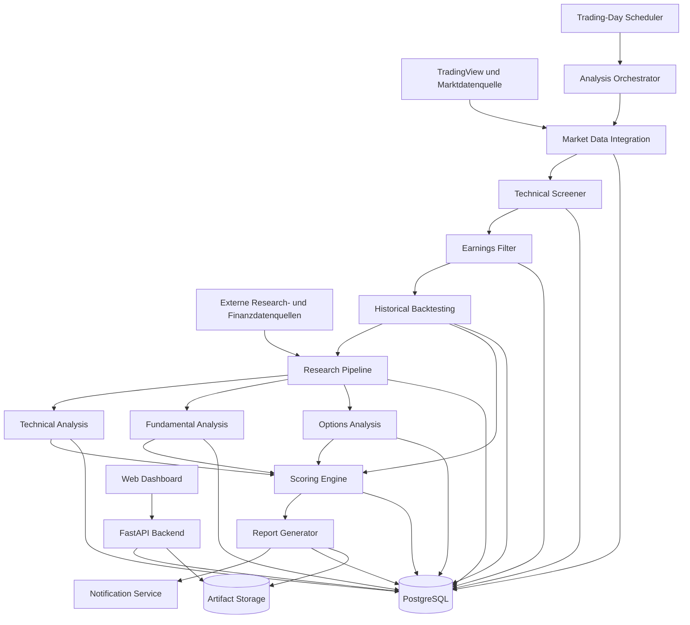
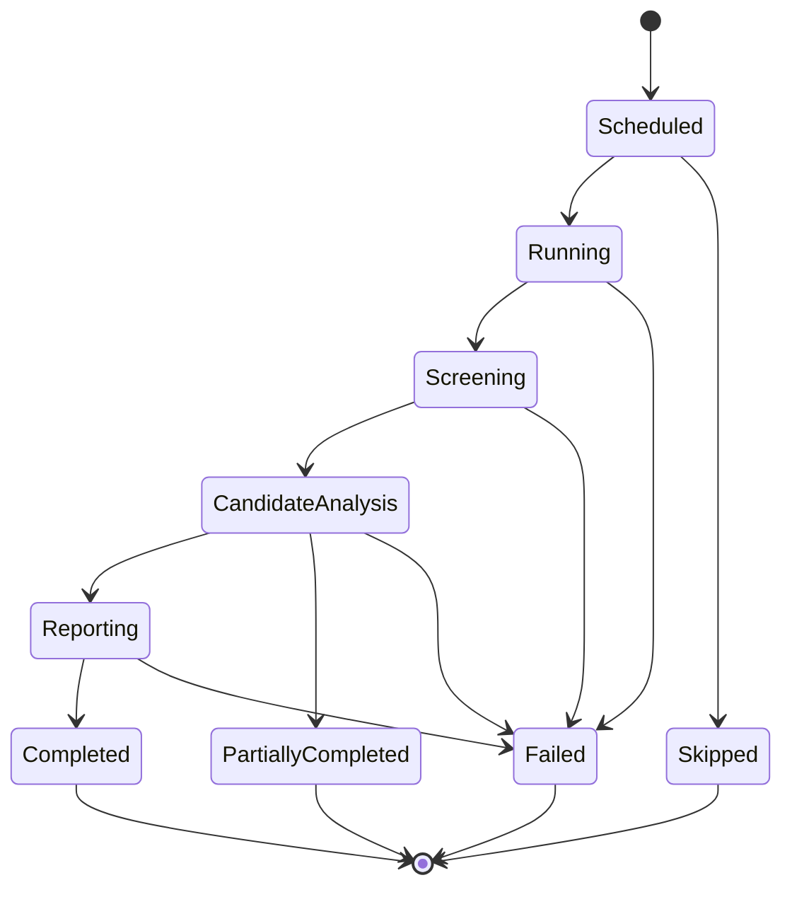
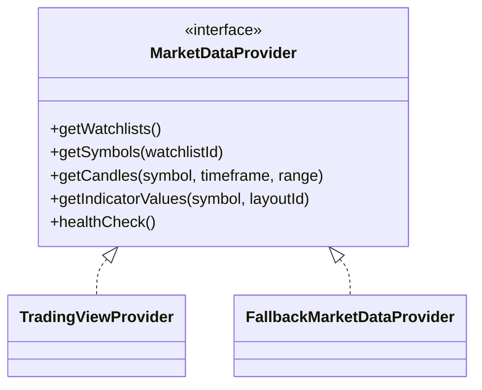
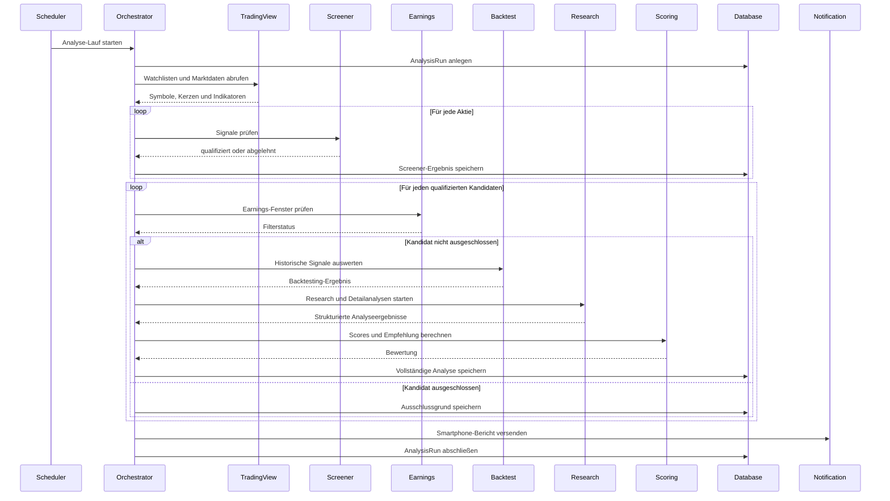
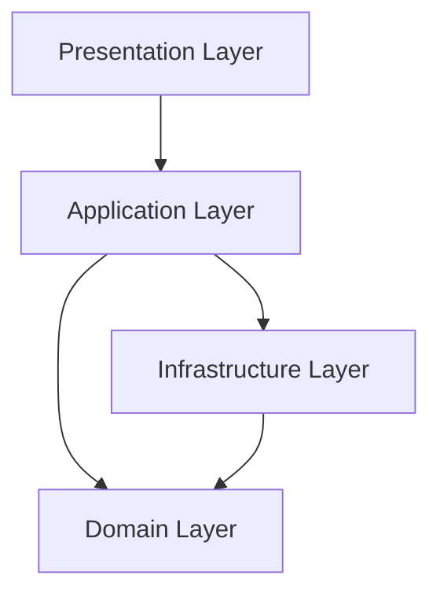
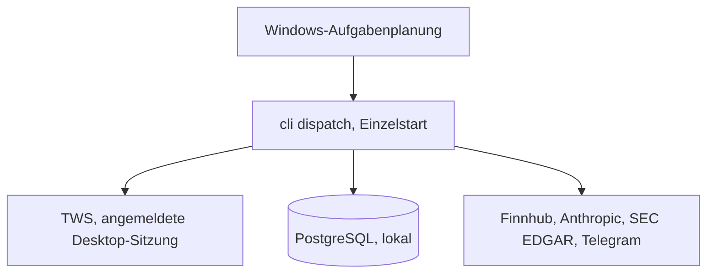
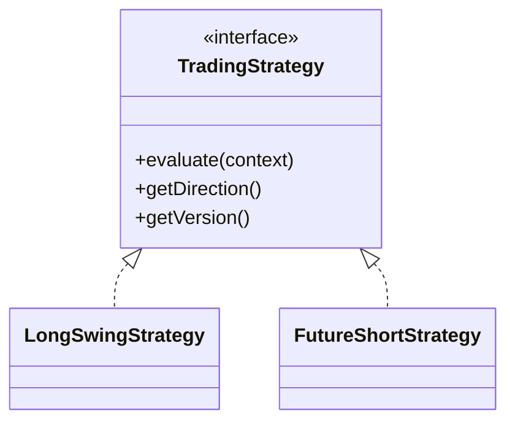

# System Architecture

## 1. Dokumentzweck

Dieses Dokument beschreibt die technische Zielarchitektur des AI Trading Analyst.

Es legt fest:

- aus welchen Komponenten die Anwendung besteht,
- wie Daten durch das System fließen,
- welche Verantwortlichkeiten die einzelnen Module besitzen,
- wie deterministische Handelslogik und KI-Analysen getrennt werden,
- wie die Anwendung auf einem Windows-Server betrieben wird,
- welche Erweiterungspunkte für spätere Funktionen vorgesehen sind.

Dieses Dokument beschreibt die Zielarchitektur. Konkrete Anbieter für Markt-, Nachrichten-, Fundamental- und Optionsdaten werden vor der Implementierung der jeweiligen Integration technisch und lizenzrechtlich evaluiert.

---

## 2. Architekturziele

Die Architektur verfolgt folgende Ziele:

### 2.1 Zuverlässigkeit

Der tägliche Analyseprozess muss reproduzierbar, überwachbar und bei Fehlern kontrolliert wiederholbar sein.

### 2.2 Nachvollziehbarkeit

Jede Analyseentscheidung muss auf gespeicherten Eingangsdaten, Regeln, Quellen und Zwischenergebnissen beruhen.

### 2.3 Modularität

Screener, Backtesting, Research, Optionsanalyse, Scoring, Reporting und Benachrichtigungen werden als getrennte Module implementiert.

### 2.4 Erweiterbarkeit

Spätere Erweiterungen wie Short-Strategien, weitere Märkte, zusätzliche Signale oder andere Datenanbieter dürfen keinen grundlegenden Umbau des Systems erfordern.

### 2.5 Trennung von deterministischer Logik und KI

Die technischen Kaufsignale werden ausschließlich durch deterministischen Programmcode ausgewertet.

Ein Sprachmodell darf:

- Signale erläutern,
- externe Informationen zusammenfassen,
- Risiken bewerten,
- qualitative Einschätzungen formulieren,
- Empfehlungen begründen.

Ein Sprachmodell darf nicht:

- technische Signalregeln verändern,
- fehlende Marktdaten erfinden,
- ein nicht erkanntes Signal nachträglich als erfüllt einstufen,
- deterministische Berechnungen ersetzen.

### 2.6 Menschliche Entscheidungshoheit

Das System spricht begründete Empfehlungen aus, führt jedoch keine Orders aus.

Die endgültige Handelsentscheidung verbleibt beim Nutzer.

---

## 3. Technologischer Zielrahmen

Die endgültigen Versionen einzelner Bibliotheken werden bei Projektbeginn festgelegt und anschließend fixiert.

### Backend

- Python
- FastAPI
- SQLAlchemy
- Alembic
- Pydantic

### Frontend

- Next.js
- TypeScript
- React
- responsives Web-Dashboard

### Datenhaltung

- PostgreSQL als primäre Datenbank
- Redis nur bei nachgewiesenem Bedarf für Queueing, Locks oder Caching
- lokales oder angebundenes Dateisystem für größere Rohartefakte, sofern erforderlich

### Hintergrundverarbeitung

Für das MVP soll die einfachste ausreichend zuverlässige Lösung verwendet werden.

Bevorzugte Reihenfolge:

1. integrierter Scheduler mit persistenter Laufverwaltung,
2. separate Worker-Prozesse für längere Analysen,
3. Redis-basierte Task Queue erst bei Bedarf.

Eine verteilte Queue-Infrastruktur darf nicht ohne konkreten technischen Nutzen eingeführt werden.

### Deployment

- Windows Server als Host, nativer Betrieb ohne Container
  ([ADR 0036](adr/0036-nativer-windows-betrieb.md))
- lokal installiertes PostgreSQL
- Auslösung über die Windows-Aufgabenplanung
- Reverse Proxy und TLS erst mit dem externen Webzugriff (F12, unentschieden)

---

## 4. High-Level-Architektur



---

## 5. Systemgrenzen

### 5.1 Bestandteil des Systems

Das System ist verantwortlich für:

- Synchronisation ausgewählter TradingView-Watchlisten,
- Abruf oder Übernahme relevanter Kurs- und Indikatordaten,
- Prüfung der definierten Long-Kaufsignale,
- Filterung anhand bevorstehender Quartalszahlen,
- historische Bewertung identischer Signalkombinationen,
- Web-Research für qualifizierte Kandidaten,
- technische und fundamentale Einordnung,
- Analyse möglicher Cash-Secured Puts,
- Berechnung transparenter Scores,
- Erstellung begründeter Empfehlungen,
- Speicherung sämtlicher Analyseergebnisse,
- Darstellung im Web-Dashboard,
- Versand einer Smartphone-Benachrichtigung.

### 5.2 Nicht Bestandteil des MVP

Nicht Bestandteil der ersten Produktphase sind:

- automatische Orderausführung,
- Brokerintegration,
- Verwaltung realer Positionen,
- autonome Portfolioentscheidungen,
- Short-Signale,
- Intraday-Dauerüberwachung,
- Hochfrequenzhandel,
- selbstständige Veränderung der Handelsstrategie,
- automatisches Training eines eigenen Vorhersagemodells.

---

## 6. Hauptkomponenten

## 6.1 Trading-Day Scheduler

Der Scheduler startet den Analyseprozess einmal pro regulärem US-Handelstag.

### Fachlicher Ausführungszeitpunkt

Die reguläre US-Handelssitzung beginnt um 09:30 Uhr in der Zeitzone `America/New_York`.

Die erste 195-Minuten-Kerze endet daher um:

- 12:45 Uhr Eastern Time.

Der Scheduler muss die Zeitzone `America/New_York` verwenden. Es darf keine feste deutsche Uhrzeit im Programmcode hinterlegt werden.

In Deutschland entspricht 12:45 Uhr Eastern Time üblicherweise 18:45 Uhr. Während der kurzen Zeiträume, in denen die USA und Europa ihre Sommerzeit an unterschiedlichen Tagen umstellen, kann die lokale deutsche Ausführungszeit abweichen.

### Anforderungen

Der Scheduler muss:

- Wochenenden erkennen,
- US-Börsenfeiertage berücksichtigen,
- verkürzte Handelstage erkennen,
- sicherstellen, dass die erste 195-Minuten-Kerze vollständig geschlossen ist,
- pro Handelstag höchstens einen regulären Lauf starten,
- manuelle Wiederholungen ermöglichen,
- parallele doppelte Läufe verhindern,
- den Startgrund protokollieren.

### Verkürzte Handelstage

Falls die reguläre Sitzung weniger als 195 Minuten dauert, wird kein reguläres 195-Minuten-Signal erzeugt.

Der Lauf muss in diesem Fall mit einem nachvollziehbaren Status beendet werden, beispielsweise:

`SKIPPED_SHORT_SESSION`

---

## 6.2 Analysis Orchestrator

Der Analysis Orchestrator steuert den vollständigen täglichen Ablauf.

Er ist für die Reihenfolge der Module verantwortlich, führt aber selbst keine fachlichen Berechnungen aus.

### Aufgaben

- Analyse-Lauf anlegen,
- Watchlisten synchronisieren,
- Aktienmenge bestimmen,
- Screener-Aufgaben koordinieren,
- Earnings-Filter ausführen,
- qualifizierte Kandidaten an Backtesting und Research übergeben,
- Fehler isolieren,
- Teilstatus speichern,
- Berichte erzeugen,
- Benachrichtigungen auslösen,
- Lauf abschließen.

### Zustandsmodell



### Mögliche Laufstatus

- `SCHEDULED`
- `RUNNING`
- `SCREENING`
- `CANDIDATE_ANALYSIS`
- `REPORTING`
- `COMPLETED`
- `PARTIALLY_COMPLETED`
- `SKIPPED_MARKET_CLOSED`
- `SKIPPED_SHORT_SESSION`
- `FAILED`

---

## 6.3 Market Data Integration

Die Market Data Integration kapselt den Zugriff auf TradingView und gegebenenfalls ergänzende Marktdatenanbieter.

### Verantwortlichkeiten

- Watchlisten abrufen,
- Symbole normalisieren,
- Börsenplätze zuordnen,
- 195-Minuten-Kerzen beziehen,
- Indikatorwerte aus dem bestehenden TradingView-Layout übernehmen, sofern technisch möglich,
- Daten auf Vollständigkeit prüfen,
- Rohdaten speichern,
- Herkunft und Abrufzeit dokumentieren.

### TradingView-Anforderung

TradingView ist die bevorzugte Datenquelle für:

- vorhandene Watchlisten,
- Chartdaten,
- Indikatorwerte des bestehenden Layouts.

Vor der Implementierung wird geprüft, welche technisch stabile und zulässige TradingView-Anbindung verfügbar ist.

Die Integration muss hinter einer internen Provider-Schnittstelle liegen.



### Fallback-Verhalten

Falls Indikatorwerte nicht zuverlässig aus dem TradingView-Layout ausgelesen werden können, muss die Architektur eine lokale Berechnung mit identischen Parametern erlauben.

Der Wechsel auf lokale Berechnung darf nur erfolgen, wenn:

- die verwendeten Parameter vollständig bekannt sind,
- die Berechnung gegen TradingView-Referenzwerte validiert wurde,
- der verwendete Berechnungsweg im Analysebericht gespeichert wird.

---

## 6.4 Technical Screener

Der Technical Screener ist vollständig deterministisch.

Er analysiert jede Aktie anhand abgeschlossener 195-Minuten-Kerzen.

### Signal A: RSI kreuzt RSI-Moving-Average

Das Signal ist erfüllt, wenn:

- der RSI in der vorherigen abgeschlossenen Kerze kleiner oder gleich seinem gleitenden Durchschnitt war,
- der RSI in der aktuellen abgeschlossenen Kerze größer als sein gleitender Durchschnitt ist.

### Signal B: Kurs durchdringt EMA20

Das Signal ist erfüllt, wenn:

- der Kurs beziehungsweise Kerzenkörper gemäß der final festgelegten Signaldefinition die EMA20 von unten nach oben durchdringt,
- die Kerze oberhalb der EMA20 schließt.

Die exakte Definition von „durchdringt“ muss vor der Implementierung als testbare Formel dokumentiert werden.

### Signal C: EMA5 kreuzt EMA20

Das Signal ist erfüllt, wenn:

- EMA5 in der vorherigen abgeschlossenen Kerze kleiner oder gleich EMA20 war,
- EMA5 in der aktuellen abgeschlossenen Kerze größer als EMA20 ist,
- die festgelegte Schlussbedingung erfüllt ist.

Die Bedeutung von „schließt darüber“ muss für dieses Signal vor der Implementierung eindeutig definiert werden. Möglich sind insbesondere:

- EMA5 liegt am Kerzenschluss über EMA20,
- oder der Aktienkurs schließt zusätzlich über beiden EMAs.

Bis zur fachlichen Freigabe darf Claude Code hierzu keine eigene Annahme dauerhaft implementieren.

### Kandidatenregel

Eine Aktie qualifiziert sich für die nächste Stufe, wenn:

- mindestens zwei der drei Kaufsignale erfüllt sind **und** zusätzlich mindestens eines der beiden Zusatzkriterien,
- die betreffenden Signale in der aktuellen oder einer der vorherigen fünf abgeschlossenen 195-Minuten-Kerzen aufgetreten sind; das Ausschlusskriterium `NO_RECENT_EMA_DOWNCROSS` wird einmal an der Entscheidungskerze geprüft.

> Geändert am 2026-09-02 durch [ADR 0056](../docs/adr/0056-kaufsignale-und-zusatzkriterien.md);
> die Formeln stehen in [g1-pruefvorlage.md](requirements/g1-pruefvorlage.md).

### Ergebnis

Der Screener speichert pro Aktie:

- geprüfte Kerzen,
- Indikatorwerte,
- Signalzeitpunkte,
- Signalkombination,
- Qualifikationsstatus,
- Ablehnungsgrund,
- verwendeten Datenanbieter,
- verwendete Signalregel-Version.

---

## 6.5 Earnings Filter

Der Earnings Filter verhindert eine vertiefte Analyse, wenn Quartalszahlen innerhalb des definierten Ausschlussfensters bevorstehen.

### Anforderungen

Der Filter muss:

- den nächsten bestätigten oder geschätzten Earnings-Termin beziehen,
- die verbleibenden regulären 195-Minuten-Kerzen bis zum Termin berechnen,
- unterschiedliche Marktzeitzonen korrekt behandeln,
- die Datenqualität des Termins kennzeichnen,
- die Quelle speichern.

### Ausschlussregel

Ein Kandidat wird ausgeschlossen, wenn der nächste Earnings-Termin innerhalb des konfigurierten Fensters von 10 bis 20 zukünftigen 195-Minuten-Kerzen liegt.

Da „10 bis 20 Kerzen“ als Bereich noch keine einzelne feste Grenzregel definiert, muss dieser Wert konfigurierbar sein.

Empfohlene Konfiguration:

```yaml
earnings_filter:
  minimum_exclusion_candles: 10
  maximum_exclusion_candles: 20
  configured_exclusion_candles: 20
```

Für das MVP wird standardmäßig die konservativere Grenze von 20 Kerzen verwendet, sofern keine andere fachliche Festlegung erfolgt.

### Unsichere Earnings-Daten

Ist kein verlässlicher Termin verfügbar, darf die Aktie nicht stillschweigend als unbedenklich eingestuft werden.

Der Status muss beispielsweise lauten:

- `CONFIRMED_CLEAR`
- `CONFIRMED_EXCLUDED`
- `ESTIMATED_CLEAR`
- `ESTIMATED_EXCLUDED`
- `UNKNOWN`

Ein Kandidat mit Status `UNKNOWN` wird im Bericht ausdrücklich als Datenrisiko gekennzeichnet.

---

## 6.6 Historical Backtesting

Das Backtesting-Modul analysiert identische Signalkombinationen der letzten fünf Jahre für dieselbe Aktie.

Es arbeitet deterministisch und unabhängig von einem Sprachmodell.

### Verantwortlichkeiten

- historische 195-Minuten-Daten laden,
- historische Signalereignisse rekonstruieren,
- identische Kombinationen erkennen,
- Einstiegspreise bestimmen,
- zukünftige Kursverläufe auswerten,
- Kennzahlen berechnen,
- Ergebnisse mit Daten- und Regelversion speichern.

### Betrachtungshorizonte

Mindestens:

- 5 Kerzen,
- 10 Kerzen,
- 20 Kerzen.

### Einstiegspreis

Standardmäßig gilt der Schlusskurs der Kerze, mit der die Signalkombination die Qualifikationsregel erstmals erfüllt.

### Zentrale Kennzahlen

- Anzahl historischer Vorkommnisse,
- Trefferquote nach 5, 10 und 20 Kerzen,
- Durchschnittsrendite,
- Medianrendite,
- Standardabweichung,
- beste Rendite,
- schlechteste Rendite,
- Maximum Adverse Excursion,
- Maximum Favorable Excursion,
- maximaler Drawdown innerhalb des Betrachtungsfensters,
- Anteil positiver Kerzenschlüsse,
- Datenabdeckung,
- Konfidenzkennzeichnung bei kleiner Stichprobe.

### Look-ahead Bias

Das Modul darf ausschließlich Informationen verwenden, die zum jeweiligen historischen Signalzeitpunkt verfügbar waren.

Zukünftige Daten dürfen nur zur anschließenden Erfolgsmessung verwendet werden.

---

## 6.7 Research Pipeline

Die Research Pipeline wird nur für Kandidaten gestartet, die Screener und Earnings-Filter bestanden haben.

Sie sammelt externe Informationen und stellt sie strukturiert für die weiteren Analysekomponenten bereit.

### Research-Bereiche

- aktuelle Unternehmensnachrichten,
- Unternehmensmeldungen,
- SEC-Filings,
- Analystenempfehlungen,
- Kursziele,
- Kurszieländerungen,
- Ratings und Ratingänderungen,
- Fundamentaldaten,
- Branchenentwicklung,
- relevante Wettbewerber,
- makroökonomische Einflussfaktoren,
- bevorstehende Unternehmensereignisse,
- wesentliche rechtliche oder regulatorische Risiken.

### Quellenanforderungen

Jede verwertete Information benötigt:

- Quelle,
- Veröffentlichungszeitpunkt,
- Abrufzeitpunkt,
- URL oder eindeutige Quellenreferenz,
- Informationstyp,
- Qualitätsbewertung,
- gegebenenfalls Anbieterhinweis.

### Quellenhierarchie

Bevorzugte Reihenfolge:

1. offizielle Unternehmensinformationen,
2. regulatorische Primärquellen,
3. etablierte Finanzdatenanbieter,
4. etablierte Nachrichtenagenturen und Wirtschaftsmedien,
5. Analystendatenanbieter,
6. sonstige Sekundärquellen.

Soziale Medien dürfen höchstens ergänzend für Sentiment verwendet werden und nicht als alleinige Grundlage einer Empfehlung dienen.

### Umgang mit Widersprüchen

Widersprüchliche Informationen werden nicht zu einer scheinbar eindeutigen Aussage vermischt.

Der Bericht muss:

- den Widerspruch benennen,
- die Quellenqualität vergleichen,
- Unsicherheit kennzeichnen.

---

## 6.8 Technical Analysis Module

Das Modul bewertet die aktuelle charttechnische Situation des Kandidaten.

Deterministische Berechnungen und KI-Interpretation müssen getrennt gespeichert werden.

### Deterministische Berechnungen

- Trendrichtung,
- RSI-Wert,
- Lage zu EMA5 und EMA20,
- Volatilität,
- Average True Range, sofern verwendet,
- jüngste Hoch- und Tiefpunkte,
- potenzielle Unterstützungs- und Widerstandszonen,
- Abstand des aktuellen Kurses zu den Zonen.

### Qualitative Interpretation

Die KI kann einordnen:

- Stärke des Trends,
- Qualität des Breakouts,
- überkaufte oder überverkaufte Situation,
- mögliche Fehlsignalrisiken,
- Verhältnis von Chance und Risiko,
- Plausibilität eines Swing-Einstiegs.

### Unterstützungen und Widerstände

Die Berechnung muss nachvollziehbar sein.

Mögliche Eingangsgrößen:

- Swing Highs und Swing Lows,
- lokale Pivot-Punkte,
- mehrfach getestete Preiszonen,
- Volumenprofile, sofern verfügbar,
- gleitende Durchschnitte,
- Gap-Zonen,
- psychologische Preisniveaus.

Jede ausgegebene Zone muss enthalten:

- unteren Wert,
- oberen Wert,
- Art der Zone,
- Stärke,
- Anzahl relevanter Berührungen,
- letzte Bestätigung,
- Abstand zum aktuellen Kurs.

---

## 6.9 Fundamental Analysis Module

Das Fundamental Analysis Module erstellt die langfristige Bewertung.

### Analysebereiche

- Umsatzwachstum,
- Gewinnwachstum,
- Free Cashflow,
- Margen,
- Kapitalrenditen,
- Verschuldung,
- Liquidität,
- Verwässerung,
- Bewertung im historischen Vergleich,
- Bewertung gegenüber Wettbewerbern,
- Marktposition,
- Wettbewerbsvorteile,
- Managementqualität,
- langfristige Chancen,
- langfristige Risiken.

### Datenqualität

Fehlende Kennzahlen dürfen nicht geschätzt oder erfunden werden.

Jede Kennzahl benötigt:

- Bezugszeitraum,
- Einheit,
- Währung,
- Quelle,
- Abrufzeitpunkt.

---

## 6.10 Options Analysis Module

Das Modul bewertet mögliche Cash-Secured-Put-Strategien.

Die Optionsanalyse darf nur ausgeführt werden, wenn aktuelle und hinreichend vollständige Optionsdaten verfügbar sind.

### Eingabedaten

- aktueller Aktienkurs,
- verfügbare Verfallstermine,
- Strikes,
- Bid,
- Ask,
- Mid-Preis,
- Delta,
- implizite Volatilität,
- Open Interest,
- Handelsvolumen,
- Earnings-Termin,
- Unterstützungszonen.

### Ausgabedaten pro Strategie

- Verfallstermin,
- Days to Expiration,
- Strike,
- Abstand zum Aktienkurs,
- Delta,
- Bid,
- Ask,
- Mid-Preis,
- angenommene realistische Prämie,
- Break-even,
- Kapitalbindung,
- einfache Rendite,
- annualisierte Rendite,
- implizite Volatilität,
- Open Interest,
- Volumen,
- Liquiditätsbewertung,
- Abstand zur nächsten Unterstützung,
- qualitative Risikobewertung.

### Liquiditätsregeln

Strategien mit unzureichender Liquidität werden nicht als bevorzugte Empfehlung dargestellt.

Warnungen werden erzeugt bei:

- großem Bid-Ask-Spread,
- sehr niedrigem Open Interest,
- sehr niedrigem Volumen,
- fehlenden Greeks,
- veralteten Kursdaten.

### Prämienberechnung

Die erwartbare Prämie darf nicht automatisch mit dem Ask-Preis gleichgesetzt werden.

Der verwendete Referenzpreis muss dokumentiert werden, beispielsweise:

- Bid,
- Mid,
- konservativ angepasster Mid-Preis.

---

## 6.11 Scoring Engine

Die Scoring Engine berechnet zwei getrennte Bewertungen:

- Swing Trade Score,
- Long-Term Investment Score.

Sie kombiniert deterministische Teilwerte und strukturierte qualitative Bewertungen.

Komponenten und Gewichte sind entschieden in
[ADR 0041](adr/0041-score-komponenten-und-gewichte.md); die Herleitung steht
dort und in [Doc 09](09%20-%20Scoring.md).

### Grundregeln

- Scores liegen zwischen 0 und 10.
- Jeder Score besitzt dokumentierte Teilkomponenten.
- Gewichtungen sind konfigurierbar und versioniert.
- Fehlende Daten werden sichtbar behandelt.
- **Fehlt eine Komponente, werden die übrigen Gewichte auf 100 % normiert.**
- **Unterhalb einer konfigurierbaren Mindestabdeckung entsteht kein Score,
  sondern `INSUFFICIENT_DATA`.** Eine fehlende Komponente wird nie mit null
  Punkten bewertet — das behauptete, sie sei geprüft und schlecht.
- Ein Score darf keine Scheingenauigkeit vortäuschen.
- Kritische Risiken können einen Score begrenzen.
- Die Begründung muss mit den Teilwerten übereinstimmen.

### Swing Trade Score

Komponenten:

- technische Signale,
- historische Signalqualität,
- Qualität des Chart-Setups,
- Chance-Risiko-Verhältnis,
- News- und Ereignislage,
- Optionsattraktivität.

### Long-Term Investment Score

Komponenten:

- Profitabilität,
- Wachstum,
- Bewertung,
- Bilanzqualität.

**Vier ursprünglich vorgesehene Komponenten tragen keinen Teilwert:**
Geschäftsqualität, Wettbewerbsvorteile, Management sowie die langfristigen
Chancen und Risiken. Sie bleiben Analysebereiche nach §6.9 und erscheinen als
Text im Bericht, werden aber nicht in eine Zahl übersetzt — es fehlt die
Vergleichsgruppe, und aus XBRL-Daten ist sie nicht abzuleiten
([ADR 0032](adr/0032-fundamentalanalyse-deterministisch.md), L5).

Sobald die KI-Hälfte der Fundamentalanalyse Einstufungen liefert — als
Aufzählungswerte nach dem Muster von
[ADR 0026](adr/0026-technical-agent-ki-einordnung.md), nie als Zahl aus
Freitext —, kommen sie als Komponenten hinzu und heben die
Berechnungsversion.

### Score-Ergebnis

Jeder Score enthält:

- Gesamtwert,
- Teilwerte,
- Gewichtungen,
- Datenabdeckung,
- Konfidenz,
- positive Faktoren,
- negative Faktoren,
- begrenzende Risiken,
- Berechnungsversion.

---

## 6.12 Report Generator

Der Report Generator führt die strukturierten Ergebnisse zusammen.

Er erzeugt keine neuen Fakten, sondern formuliert ausschließlich auf Basis gespeicherter Analyseergebnisse.

### Berichtsvarianten

- vollständiger Dashboard-Bericht,
- kompakte Smartphone-Zusammenfassung,
- maschinenlesbares JSON-Ergebnis,
- optional exportierbares Dokument in einer späteren Phase.

### Mindestinhalt des vollständigen Berichts

1. Symbol und Unternehmen
2. Analysezeitpunkt
3. erkannte technische Signale
4. Earnings-Status
5. historische Signalstatistik
6. aktuelle technische Lage
7. Unterstützungen und Widerstände
8. wesentliche Nachrichten
9. Analystenmeinungen und Kursziele
10. fundamentale Bewertung
11. Chancen
12. Risiken
13. mögliche Put-Verkaufsstrategien
14. Swing Trade Score
15. Long-Term Investment Score
16. konkrete Empfehlung
17. Konfidenz und Datenlücken
18. verwendete Quellen

### Empfehlungsstufen

Beispielhafte Empfehlungsstufen:

- `STRONG_CANDIDATE`
- `CANDIDATE`
- `WATCH`
- `AVOID_FOR_NOW`
- `INSUFFICIENT_DATA`

Die endgültige deutsche Formulierung wird in den KI-Leitlinien festgelegt.

---

## 6.13 Notification Service

Der Notification Service versendet nach Abschluss eines Analyse-Laufs eine Smartphone-Benachrichtigung.

### Bevorzugte MVP-Lösung

Die endgültige Auswahl erfolgt nach einem kurzen technischen Vergleich.

Bewertungskriterien:

- einfache Einrichtung,
- zuverlässige Push-Zustellung,
- Unterstützung von Links,
- geringe Betriebskosten,
- sichere Token-Verwaltung,
- gute Nutzbarkeit unter iOS und Android.

Geeignete Kandidaten sind insbesondere:

- Pushover,
- Telegram Bot.

### Inhalt der Benachrichtigung

- Anzahl gefundener Kandidaten,
- Symbol,
- Swing Trade Score,
- Long-Term Investment Score,
- wichtigste Signalgründe,
- wichtigste Risikowarnung,
- Link zum vollständigen Dashboard-Bericht.

### Verhalten ohne Kandidaten

Auch ein Lauf ohne Kandidaten muss im Dashboard gespeichert werden.

Ob zusätzlich eine „Keine Kandidaten“-Push-Nachricht versendet wird, ist konfigurierbar.

---

## 6.14 Web API

> **Zuschnitt des MVP:** Die API ist **lesend**. `POST /analysis-runs` und
> `…/retry` bleiben Zielbild und werden nicht gebaut — auf dem Server
> schriebe ein Auslöser über HTTP einen Lauf aus Fixture-Werten in die
> Produktivdatenbank. Ebenso entfällt der Sammelendpunkt `/dashboard`.
> Entschieden in [ADR 0053](adr/0053-lese-api-kein-lauf-ueber-http.md), die
> gebaute Fassung steht in Doc 11.

Das Backend stellt eine versionierte REST API bereit.

Basispräfix:

`/api/v1`

### Beispielendpunkte

```text
GET    /api/v1/dashboard
GET    /api/v1/analysis-runs
GET    /api/v1/analysis-runs/{run_id}
POST   /api/v1/analysis-runs
POST   /api/v1/analysis-runs/{run_id}/retry
GET    /api/v1/stock-analyses
GET    /api/v1/stock-analyses/{analysis_id}
GET    /api/v1/stocks
GET    /api/v1/stocks/{symbol}
GET    /api/v1/stocks/{symbol}/analyses
GET    /api/v1/stocks/{symbol}/backtests
GET    /api/v1/watchlists
POST   /api/v1/watchlists/sync
GET    /api/v1/system/health
GET    /api/v1/system/readiness
```

### API-Grundsätze

- eindeutige Request- und Response-Schemas,
- konsistente Fehlerstruktur,
- Pagination bei Listen,
- Filterung und Sortierung,
- keine Geschäftslogik in API-Controllern,
- Authentifizierung für alle privaten Endpunkte,
- separate Berechtigung für manuelle Analyse-Läufe,
- OpenAPI-Dokumentation.

---

## 6.15 Web Dashboard

> **Zuschnitt des MVP:** Gebaut werden drei der zehn Hauptansichten —
> Tagesübersicht, Detailansicht und historische Analysen pro Aktie
> ([ADR 0053](adr/0053-lese-api-kein-lauf-ueber-http.md)). Die Detailansicht
> zeigt den gespeicherten Bericht mit allen achtzehn Punkten und deckt damit
> Backtesting, Optionsstrategien und Quellen bereits inhaltlich ab; als
> eigene Ansichten bleiben sie Zielbild, ebenso Systemstatus und
> Konfiguration. Das Dashboard ist ausschließlich aus dem eigenen Netz
> erreichbar ([ADR 0049](adr/0049-dashboard-mvp-nur-lan.md)) und wird als
> statischer Export von der API mit ausgeliefert
> ([ADR 0052](adr/0052-dashboard-als-statischer-export.md)).

Das Dashboard ist eine responsive Webanwendung.

### Hauptansichten

- Tagesübersicht,
- Liste aller Analyse-Läufe,
- Liste aktueller Kandidaten,
- Detailansicht einer Aktie,
- historische Analysen pro Aktie,
- Backtesting-Ansicht,
- Optionsstrategien,
- Quellenübersicht,
- Systemstatus,
- Konfiguration.

### Tagesübersicht

Die Tagesübersicht zeigt mindestens:

- Status des aktuellen Laufs,
- Zeitpunkt des letzten erfolgreichen Laufs,
- Anzahl gescreenter Aktien,
- Anzahl qualifizierter Kandidaten,
- Anzahl ausgeschlossener Earnings-Kandidaten,
- Top-Kandidaten nach Swing Score,
- Warnungen und Datenprobleme.

### Detailansicht

Die Detailansicht enthält:

- Kurzfazit,
- beide Scores,
- Signale und Signalzeitpunkte,
- Chartdaten,
- Unterstützungen und Widerstände,
- Backtesting-Kennzahlen,
- Research-Zusammenfassung,
- Analystenmeinungen,
- Fundamentaldaten,
- Optionsvorschläge,
- Risiken,
- Quellen.

---

## 7. Datenfluss eines täglichen Analyse-Laufs



---

## 8. Datenarchitektur

PostgreSQL ist das primäre System of Record.

### Datenkategorien

#### Stammdaten

- Aktien,
- Börsen,
- Watchlisten,
- Datenanbieter,
- Strategiedefinitionen.

#### Zeitreihendaten

- Kerzen,
- Indikatorwerte,
- Optionsketten,
- Kurs-Snapshots.

#### Prozessdaten

- Analyse-Läufe,
- Modulstatus,
- Fehler,
- Wiederholungen,
- Laufzeiten.

#### Analyseergebnisse

- Signale,
- Earnings-Status,
- Backtests,
- Research-Ergebnisse,
- technische Bewertungen,
- fundamentale Bewertungen,
- Optionsstrategien,
- Scores,
- Empfehlungen.

#### Quellen und Provenienz

- Quellenreferenzen,
- Abrufzeitpunkte,
- Veröffentlichungszeitpunkte,
- Rohantwort-Hashes,
- Anbieter,
- Datenqualität.

### Unveränderlichkeit historischer Analysen

Abgeschlossene Analyseberichte werden nicht überschrieben.

Korrekturen oder Neuberechnungen erzeugen eine neue Version mit Referenz auf die ursprüngliche Analyse.

### Versionierung

Mindestens folgende Versionen werden gespeichert:

- Signalregel-Version,
- Scoring-Version,
- Prompt-Version,
- Datenanbieter-Version,
- Berichtsschema-Version,
- Anwendungsversion.

---

## 9. Interne Modulgrenzen

Die Anwendung folgt einer geschichteten Struktur.



### Presentation Layer

Enthält:

- FastAPI-Endpunkte,
- Request- und Response-Schemas,
- Frontend.

### Application Layer

Enthält:

- Use Cases,
- Orchestrierung,
- Transaktionsgrenzen,
- Berechtigungsprüfungen.

### Domain Layer

Enthält:

- Signalregeln,
- Earnings-Regeln,
- Backtesting-Logik,
- Scoring-Regeln,
- Domain-Modelle,
- Provider-Schnittstellen.

Der Domain Layer darf nicht von FastAPI, SQLAlchemy, TradingView oder einem konkreten KI-Anbieter abhängen.

### Infrastructure Layer

Enthält:

- Datenbank-Repositories,
- TradingView-Adapter,
- Research-Provider,
- Optionsdaten-Provider,
- KI-Provider,
- Benachrichtigungsadapter,
- Scheduler-Implementierung.

---

## 10. Agenten- und KI-Architektur

Der Begriff „Agent“ bezeichnet in diesem Projekt eine klar abgegrenzte Analysekomponente. Nicht jede Komponente benötigt ein autonomes Agenten-Framework.

### Grundsatz

Es soll zunächst ein kontrollierter Workflow mit strukturierten Ein- und Ausgaben verwendet werden.

Ein Agenten-Framework wie LangGraph darf nur eingesetzt werden, wenn es einen konkreten Vorteil bietet, beispielsweise:

- wiederaufnehmbare Workflows,
- kontrollierte Verzweigungen,
- persistente Zustände,
- definierte Retry-Logik,
- nachvollziehbare Tool-Aufrufe.

### Strukturierte Ausgaben

Jede KI-Komponente muss gegen ein festes Schema validiert werden.

Beispiel:

```json
{
  "summary": "string",
  "positive_factors": ["string"],
  "negative_factors": ["string"],
  "risks": ["string"],
  "confidence": 0.0,
  "source_ids": ["string"]
}
```

Freitext ohne strukturierte Felder reicht als interne Schnittstelle nicht aus.

### Quellenbindung

Aussagen über aktuelle Nachrichten, Analystenmeinungen, Kursziele oder Fundamentaldaten müssen auf gespeicherte Quellen verweisen.

### Halluzinationsschutz

Wenn keine belastbaren Informationen vorliegen, lautet das Ergebnis sinngemäß:

`INSUFFICIENT_DATA`

Fehlende Informationen dürfen nicht durch vermeintlich plausible Werte ersetzt werden.

---

## 11. Fehlerbehandlung und Resilienz

### Fehlerisolation

Der Fehler einer einzelnen Aktie darf nicht automatisch den gesamten Tageslauf abbrechen.

### Retry-Strategie

Automatische Wiederholungen sind nur für temporäre Fehler zulässig, beispielsweise:

- Netzwerkfehler,
- Rate Limits,
- vorübergehende Anbieterfehler,
- Timeouts.

Fachliche Validierungsfehler werden nicht automatisch wiederholt.

### Idempotenz

Ein wiederholter Analyse-Lauf für denselben Handelstag darf keine unkontrollierten Duplikate erzeugen.

Jeder Lauf erhält eine eindeutige ID.

### Teilweise erfolgreiche Läufe

Wenn einzelne Kandidaten fehlschlagen, wird der Lauf als `PARTIALLY_COMPLETED` abgeschlossen.

Erfolgreiche Ergebnisse bleiben verfügbar.

### Circuit Breaker

Für instabile externe Anbieter soll ein Circuit-Breaker-Muster vorgesehen werden, sofern wiederholte Ausfälle auftreten.

---

## 12. Logging, Monitoring und Auditierbarkeit

### Strukturierte Logs

Logs werden maschinenlesbar ausgegeben.

Pflichtfelder:

- Timestamp,
- Log Level,
- Correlation ID,
- Analysis Run ID,
- Stock Symbol, sofern relevant,
- Modul,
- Ereignis,
- Fehlercode,
- Laufzeit.

### Metriken

Mindestens folgende Metriken werden erfasst:

- Dauer eines Analyse-Laufs,
- Anzahl gescreenter Aktien,
- Anzahl Kandidaten,
- Anzahl ausgeschlossener Kandidaten,
- Fehler pro Datenanbieter,
- Dauer einzelner Module,
- KI-Tokenverbrauch,
- externe API-Kosten, sofern verfügbar,
- Benachrichtigungserfolg,
- letzter erfolgreicher Lauf.

### Health Checks

Das Backend stellt bereit:

- Liveness Check,
- Readiness Check,
- Datenbankstatus,
- Status kritischer Provider,
- Schedulerstatus.

### Audit-Trail

Für jede finale Empfehlung muss nachvollziehbar sein:

- welche Daten verwendet wurden,
- welche Regeln angewendet wurden,
- welche Quellen einflossen,
- welche Modell- und Prompt-Version verwendet wurde,
- wie die Scores entstanden.

---

## 13. Sicherheit

### Authentifizierung

Das Dashboard ist nicht öffentlich zugänglich.

Mindestens erforderlich:

- Login,
- sichere Passwortspeicherung,
- Sitzungsablauf,
- Schutz administrativer Funktionen.

### Netzwerkzugriff

Bevorzugt wird:

- Zugriff über privates Netzwerk oder VPN,
- alternativ abgesicherter Reverse Proxy mit TLS.

Eine ungeschützte direkte Veröffentlichung von Backend- oder Datenbankports ist unzulässig.

### Secrets

Secrets werden nicht im Repository gespeichert.

Dazu gehören:

- TradingView-Zugangsdaten,
- API-Schlüssel,
- KI-Anbieter-Schlüssel,
- Datenbankpasswörter,
- Notification Tokens,
- Session Secrets.

Secrets werden über Umgebungsvariablen oder einen geeigneten Secret Store bereitgestellt.

### Datenschutz

Da es sich um ein persönliches System handelt, werden nur die für den Betrieb notwendigen Nutzerdaten gespeichert.

### Eingabeschutz

Externe Research-Inhalte gelten als nicht vertrauenswürdig.

Die Research Pipeline muss Schutzmaßnahmen gegen Prompt Injection und manipulative Webseiteninhalte enthalten.

Externe Inhalte dürfen keine Systemregeln, Tool-Berechtigungen oder Bewertungslogik verändern.

---

## 14. Deployment auf Windows Server

Beschlossen in [ADR 0036](adr/0036-nativer-windows-betrieb.md). Die
ausführliche Anleitung steht in Doc 13 und Doc 14.

### Zielstruktur

Ein Windows-Server trägt alles: die Interactive-Brokers-TWS, PostgreSQL und
den Analyzer.



**Keine Container.** Die TWS ist eine Desktop-Anwendung und braucht eine
angemeldete Windows-Sitzung (ADR 0014 E2, [ADR 0018](adr/0018-kein-windows-autologon.md));
sie ist zugleich die Quelle aller Kursdaten. Ein Compose-Verbund müsste sie
außerhalb lassen. Die vollständige Begründung steht in ADR 0036.

Containerisierung war vertagt, nicht verworfen: Sie sollte zum
Dashboard-Sprint neu bewertet werden, sobald mit dem Frontend erstmals etwas
entsteht, das ausgeliefert werden muss. **Die Neubewertung ist erfolgt und
bleibt beim Ergebnis** ([ADR 0052](adr/0052-dashboard-als-statischer-export.md)):
Das Dashboard wird als statischer Export von derselben FastAPI-Anwendung mit
ausgeliefert, die die Lese-API bereitstellt. Ein Reverse Proxy hätte weiterhin
keinen Zweck, solange nichts nach außen erreichbar ist
([ADR 0049](adr/0049-dashboard-mvp-nur-lan.md)).

### Bestandteile

- Backend in einer virtuellen Python-Umgebung, installiert aus der Lock-Datei
  mit Hash-Verifikation ([ADR 0008](adr/0008-reproduzierbare-installation.md)),
- lokal installiertes PostgreSQL,
- ein Eintrag in der Windows-Aufgabenplanung als einziger Auslöser.

Mit Sprint 6 kommt die **Frontend-Auslieferung** hinzu und mit ihr der erste
Dauerprozess: `uvicorn` als Autostart-Eintrag der Aufgabenplanung, der API
und statisches Dashboard aus einem Prozess bedient (ADR 0052). Der Auslöser
der Analyse bleibt davon unberührt — die API kann keinen Lauf starten
([ADR 0053](adr/0053-lese-api-kein-lauf-ueber-http.md)).

Nicht Bestandteil des MVP: Worker-Dienst (der Dispatcher ist ein idempotenter
Einzelstart, [ADR 0019](adr/0019-trading-day-dispatcher.md)), Reverse Proxy
(setzt externen Zugriff voraus, den ADR 0049 ausschließt) und Redis
([ADR 0006](adr/0006-kein-redis-im-mvp.md)).

### Persistente Daten

Persistiert werden:

- PostgreSQL-Daten,
- Anwendungslogs, sofern nicht extern gesammelt,
- Konfigurationen ohne Secrets.

Geheimnisse liegen ausschließlich in Umgebungsvariablen mit Präfix `ATA_`
([ADR 0005](adr/0005-konfiguration-und-secrets.md)) und werden nicht
mitgesichert. Ein Sicherungsverfahren ist noch nicht beschlossen — siehe §15.

### Neustartverhalten

Nach einem Serverneustart sind Anmeldung und TWS-Start manuell; das ist die
akzeptierte Einschränkung aus ADR 0018. Ein automatischer Start der
Anwendung ist damit ausgeschlossen.

Ein unterbrochener Analyse-Lauf muss als unterbrochen erkannt und
kontrolliert behandelt werden. Der Dispatcher erfüllt das: Er rechnet
höchstens einmal je Handelstag und meldet einen ausgefallenen Lauf über den
Benachrichtigungskanal, sobald die Nachholfrist abgelaufen ist.

### Migrationen

Datenbankmigrationen werden über Alembic verwaltet und beim Aktualisieren von
Hand ausgeführt. Ein zweiter Prozess, der sie parallel anstoßen könnte,
existiert nicht.

---

## 15. Backup und Wiederherstellung

> **Umsetzungsstand:** Der Abschnitt „Sicherung" in
> [Doc 14](14%20-%20Inbetriebnahme%20und%20Betrieb.md) setzt die einfache
> Stufe davon um — täglicher `pg_dump` über die Aufgabenplanung, vierzehn
> Tage rollierend, mit Lesbarkeitsprüfung und durchgespielter
> Wiederherstellung (`scripts/sicherung.ps1`, `scripts/sicherung-probe.ps1`). **Eine der fünf
> Mindestanforderungen bleibt bewusst offen:** Die Ablage liegt auf demselben
> Laufwerk, schützt also gegen Fehlbedienung und kaputte Migration, nicht
> gegen den Ausfall der Platte. Neu zu bewerten nach stabilem Betrieb. Das
> Zielbild unten bleibt unverändert stehen — es ist der Maßstab, an dem diese
> Einschränkung eine Einschränkung ist.

### Zu sichernde Daten

- PostgreSQL-Datenbank,
- gespeicherte Analyseartefakte,
- Konfiguration,
- verschlüsselte Secrets oder deren externe Sicherung,
- Deployment-Dateien.

### Mindestanforderungen

- automatisiertes tägliches Datenbank-Backup,
- definierte Aufbewahrungsfrist,
- regelmäßiger Restore-Test,
- Sicherung außerhalb des primären Datenvolumes,
- dokumentierter Wiederherstellungsprozess.

### Wiederherstellungsziele

Die konkreten Werte werden bei der Deployment-Planung festgelegt.

Für das persönliche System gilt als Ausgangspunkt:

- maximal ein Handelstag Datenverlust,
- Wiederherstellung innerhalb weniger Stunden.

---

## 16. Testarchitektur

### Unit Tests

Pflicht für:

- Signalerkennung,
- Kandidatenregel,
- Earnings-Kerzenberechnung,
- Backtesting-Kennzahlen,
- Renditeberechnung,
- Optionskennzahlen,
- Scoring.

### Integrationstests

Pflicht für:

- Datenbank-Repositories,
- API-Endpunkte,
- Provider-Adapter,
- Scheduler,
- Benachrichtigungen.

### Contract Tests

Provider-Adapter erhalten Contract Tests gegen gespeicherte Beispielantworten.

### Golden-Master-Tests

Für ausgewählte Aktien und bekannte historische Zeiträume werden Referenzergebnisse gespeichert.

Damit wird geprüft, ob Änderungen unbeabsichtigt Signalerkennung oder Backtesting verändern.

### End-to-End-Test

Ein vollständiger Testlauf muss möglich sein mit:

- lokaler Beispieldatenquelle,
- festen historischen Daten,
- simulierten Research-Ergebnissen,
- deaktiviertem echten Push-Versand.

### KI-Tests

KI-Ausgaben werden geprüft auf:

- gültiges Schema,
- Quellenreferenzen,
- fehlende erfundene Kennzahlen,
- konsistente Scores,
- Einhaltung der KI-Leitlinien.

---

## 17. Konfiguration

Konfigurierbare Werte werden zentral verwaltet.

Beispiele:

```yaml
market:
  timezone: America/New_York
  regular_session_open: "09:30"
  timeframe_minutes: 195
  daily_candle_index: 1

screening:
  required_crossing_signals: 2
  signal_lookback_previous_candles: 5
  direction: LONG

backtesting:
  history_years: 5
  horizons:
    - 5
    - 10
    - 20

earnings_filter:
  configured_exclusion_candles: 20

notifications:
  send_when_no_candidates: false

scoring:
  swing_version: "1.0"
  long_term_version: "1.0"
```

Secrets gehören nicht in diese Datei.

Konfigurationsänderungen müssen protokolliert werden.

---

## 18. Erweiterungspunkte

### Short-Strategien

Long- und Short-Regeln werden über eine gemeinsame Strategie-Schnittstelle getrennt implementiert.



### Weitere Zeitrahmen

Der Timeframe darf nicht fest in der gesamten Anwendung verteilt sein.

Die 195-Minuten-Einstellung wird zentral konfiguriert und als Teil des Analysekontexts weitergegeben.

### Weitere Datenanbieter

Jede externe Integration wird über eine Provider-Schnittstelle angebunden.

### Weitere Benachrichtigungskanäle

Der Notification Service unterstützt austauschbare Adapter.

### Brokerintegration

Eine mögliche spätere Brokerintegration wird als eigenes Modul betrachtet und erhält keinen direkten Zugriff aus der KI-Analyse.

---

## 19. Architekturentscheidungen vor Implementierungsbeginn

Vor der Implementierung müssen folgende Entscheidungen dokumentiert werden:

1. Welche technisch und lizenzrechtlich geeignete TradingView-Anbindung wird verwendet?
2. Können Watchlisten und Indikatorwerte des bestehenden Layouts zuverlässig abgerufen werden?
3. Wie lauten die exakten Parameter für RSI und RSI-Moving-Average?
4. Wie wird „Kurs durchdringt EMA20“ mathematisch definiert?
5. Wie wird „EMA5 schneidet EMA20 und schließt darüber“ exakt definiert?
6. Welche Datenquelle liefert historische 195-Minuten-Kerzen für fünf Jahre?
7. Welche Quelle liefert verlässliche Earnings-Termine?
8. Welche Quelle liefert Optionsketten und Greeks?
9. Welche Quellen liefern Analystenratings und Kursziele?
10. Welcher Benachrichtigungskanal wird im MVP verwendet?
11. Welcher KI-Anbieter beziehungsweise welches Modell wird für welche Analyseaufgabe verwendet?
12. Wird Redis im MVP tatsächlich benötigt?
13. Wie erfolgt der sichere externe Zugriff auf das Dashboard?

Diese Entscheidungen werden als Architecture Decision Records im Verzeichnis `docs/adr/` abgelegt.

**Alle dreizehn sind entschieden.** Die letzte war Nummer 13: Im MVP gibt es
keinen externen Zugriff — das Dashboard bleibt im eigenen Netz, ohne eigene
Authentifizierung ([ADR 0049](adr/0049-dashboard-mvp-nur-lan.md)); die
Exposition wird nach stabilem Betrieb neu bewertet. Den Stand aller
Entscheidungen führt `docs/adr/README.md`.

---

## 20. Definition der architektonischen Fertigstellung

Die Architektur gilt für den MVP als umgesetzt, wenn:

- der tägliche Lauf zeitzonenkorrekt startet,
- ausschließlich geschlossene Kerzen verwendet werden,
- alle technischen Signale deterministisch geprüft werden,
- mindestens ein TradingView-kompatibler Provider implementiert ist,
- der Earnings-Filter funktioniert,
- Backtesting-Ergebnisse reproduzierbar sind,
- Research-Ergebnisse Quellenreferenzen besitzen,
- beide Scores transparent berechnet werden,
- vollständige Analysen gespeichert werden,
- das Dashboard historische und aktuelle Analysen anzeigt,
- eine Smartphone-Benachrichtigung versendet wird,
- ein Lauf ohne manuelle Eingriffe abgeschlossen werden kann,
- Fehler und Teilergebnisse nachvollziehbar gespeichert werden,
- Backup und Wiederherstellung dokumentiert und getestet sind,
- keine API-Schlüssel oder Passwörter im Repository enthalten sind.