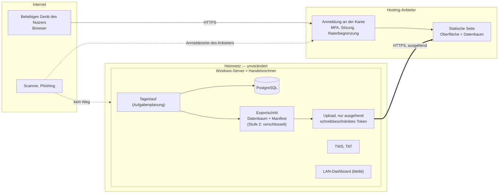
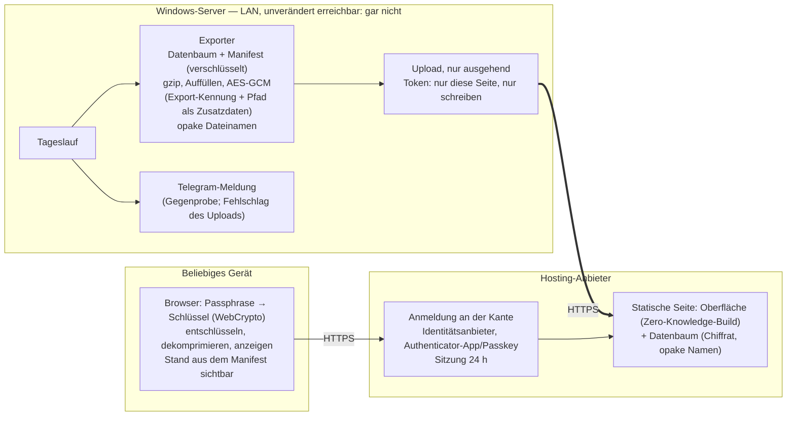

# F12 — Dashboard außerhalb des Servers: Spike-Bericht

- Status: **Erledigt.** [ADR 0060](../adr/0060-dashboard-ausserhalb-des-servers.md)
  ist am **2026-09-17 angenommen**: Die sieben Entscheidungspunkte hat der
  Inhaber am 2026-09-07 beschieden (**Abschnitt 10.3**), O1 und O3 folgten
  (**Abschnitt 10.4**), und der Proof of Concept aus Abschnitt 11 ist beim
  Anbieter durchgeführt und abgenommen — Doc 14, **Stufe L**, und die
  [Anbieterevaluation](f12-hosting-anbieter-evaluation.md). Dieses Dokument
  bleibt als Beleg erhalten, wie
  [earnings-anbieter-evaluation.md](earnings-anbieter-evaluation.md) und
  [g3-entscheidungsvorlage.md](g3-entscheidungsvorlage.md).
- Datum: 2026-09-06
- Gegenstand: Frage 13 aus Doc 10 §19 (F12, externer Zugriff auf das
  Dashboard), **zweiter Ansatz.** Der erste Spike vom selben Tag —
  privater Fernzugang zum Server über ein identitätsgebundenes Overlay-Netz
  — ist **zurückgestellt**: siehe
  [ADR 0059](../adr/0059-fernzugang-dashboard-overlay-netz.md) (Vorgeschlagen,
  nicht angenommen) und den
  [Overlay-Spike](f12-externer-zugriff-spike.md), dort Abschnitt 15 zum Stand.
  Dieser Spike prüft den umgekehrten Weg: Nicht der Nutzer kommt zum
  Server, sondern die Ergebnisse gehen zum Nutzer — das Dashboard läuft
  außerhalb des Windows-Servers, und der Server bleibt unerreichbar.
- Vorgaben des Inhabers (2026-09-06, vor Beginn der Ausarbeitung erfragt):
  1. Ein **Snapshot nach jedem Lauf** genügt; kein jederzeit aktueller
     Datenbankstand.
  2. Standard-Hosting mit Anmeldung davor **und** eine Zero-Knowledge-Variante
     (Anbieter sieht nur Chiffrat) sind beide zu bewerten; der Spike
     empfiehlt.
  3. Anbieter, Kosten, Standort: **keine Vorgabe** — nach Sicherheit und
     Aufwand entscheiden.
  4. Außerhalb sollen **alle Ansichten** des LAN-Dashboards verfügbar sein,
     einschließlich Chart mit voller Kursreihe und Backtests.
  5. Zugriff von **beliebigen Geräten** aus; eine einfache Anmeldung
     (Passwort, Authenticator-App oder Vergleichbares) genügt — der Zugriff
     auf das Dashboard gilt dem Inhaber als nicht sicherheitskritisch.
- Untersuchter Stand: Branch `dev`, Commit `cbbe978` (Merge von PR #75),
  Working Tree sauber. Die Ist-Aufnahme des ersten Spikes gilt fort; hier
  steht nur, was für den neuen Weg zählt, ergänzt um gemessene
  Datenmengen.
- **Ausdrücklich außerhalb des Umfangs:** jede Änderung an Anwendungscode,
  Infrastruktur, Konten, DNS, Zertifikaten oder dem laufenden Server. Es
  wurde nichts installiert, nichts registriert und keine Geheimnisdatei
  gelesen.

## Kennzeichnung in diesem Dokument

| Kennzeichen | Bedeutung |
|---|---|
| **Belegt** | im Repository verifiziert oder dort gemessen; die Fundstelle steht dabei |
| **Annahme** | plausibel, aber nicht belegt; vor dem PoC zu bestätigen |
| **Offen** | Information, die im Repository nicht steht; als Frage in Abschnitt 10 geführt |

Kürzel: Annahmen **A1–A6**, Dokumentationsbefunde **D1–D5**, Anforderungen
**S1–S18** (Kontrollmaßnahmen der Aufgabenstellung), Vorgaben des Inhabers
**I1–I5**, Rahmen **P1–P8**, Schutzgüter **SG1–SG7**, Bedrohungen
**T1–T22**, Varianten **H0–H4** mit Datenweg **DW1–DW4** und Bauweise
**B1–B3**, Restrisiken **R1–R10**, offene Fragen **O1–O12**,
Entscheidungspunkte **E1–E7**, Abnahmekriterien **AK1–AK18**, Negativtests
**N1–N19**, Rückbau **RB1–RB8**, Notausschalter **K1–K5**.

Produkte und Dienste werden **beispielhaft** genannt; die Anbieterwahl
gehört in den PoC, zusammen mit der Prüfung der Nutzungsbedingungen.

---

## 1. Zusammenfassung

**Der Weg dreht sich um.** Statt den Server für Geräte des Nutzers
erreichbar zu machen, verlässt nach jedem Lauf ein **Snapshot der
Ergebnisse** den Server — als statische Dateien, ausschließlich ausgehend
hochgeladen, mit einem schreibbeschränkten Token. Außerhalb zeigt sie
dieselbe Oberfläche wie im LAN, gebaut als statischer Export. Der Server
bekommt keinen eingehenden Port, keinen Agenten, keinen Tunnel; was auf
ihm läuft, ändert sich um einen Exportschritt, der wie die
Telegram-Meldung isoliert ist und den Lauf nicht scheitern lassen kann.

**Was das kostet:** Die Analyseergebnisse — Berichte mit Modelltext (heute
vom Technical Agent; die Recherche läuft im Dauerbetrieb mit `none`,
ADR 0051), Optionsvorschläge, Kursreihen aller rund 190 Aktien, damit die Watchlist —
liegen dann bei einem Hosting-Anbieter. Finnhubs Einschränkung L8 und das
Deployment-Gate aus ADR 0022 stellen sich damit anders als bisher: nicht
als Frage nach fremden Lesern, sondern nach dem Anbieter als Dritten. Und
die Anzeige hängt an der Integrität des Hosts: Wer Host oder Token
kontrolliert, kontrolliert, was der Nutzer sieht.

**Empfehlung in zwei Stufen:**

- **Stufe 1 — statischer Export bei einem Anbieter mit Anmeldung an der
  Kante** (beispielhaft: Cloudflare Pages mit Access, Azure Static Web
  Apps; MFA über ein Identitätsanbieter-Konto mit Authenticator-App oder
  Passkey — ein E-Mail-Einmalcode ist nur ein Faktor und bleibt Rückfall).
  Jedes Gerät mit Browser, keine Client-Software, nichts
  zu patchen, kostenlose Stufen vorhanden. Der Anbieter sieht die Daten im
  Klartext.
- **Stufe 2 — Zero-Knowledge:** Der Export wird auf dem Server mit einer
  Passphrase verschlüsselt (AES-GCM, Schlüssel aus der Passphrase
  abgeleitet, Export-Kennung und Dateipfad als Zusatzdaten, Manifest
  ebenfalls verschlüsselt, opake Dateinamen); die Oberfläche entschlüsselt
  im Browser — in einem Build, der Klartext gar nicht annimmt. Der Anbieter
  sieht Chiffrat und Metadaten (Dateizahl, Größenklassen); gefälschte,
  vertauschte oder veraltete Datendateien verwirft der Browser, und die
  Passphrase ist genau die „einfache Anmeldung", die der Inhaber wollte —
  die Anmeldung an der Kante bleibt als MFA davor. Das verringert das
  Lizenzrisiko erheblich; ob verschlüsselte Ablage bei einem Anbieter eine
  „Weitergabe" ist, bleibt eine Einordnung des Inhabers (O1).

**Der zurückgestellte Overlay-Weg bleibt der sicherere Zugang zum Server
selbst** (kein öffentlicher Endpunkt, Ende-zu-Ende, gerätegebunden) — aber
er verlangt Client-Software auf jedem Gerät, und genau das will der Inhaber
nicht. Beide Wege schließen sich nicht aus; dieser hier braucht den anderen
nicht.

**Gemessen und hochgerechnet:** Der Chart einer Aktie ist gemessen 141 Byte
je Kerze (830 Kerzen: 114 KB roh, 26 KB komprimiert), hochgerechnet auf
fünf Jahre rund 350 KB roh und 80 KB komprimiert. Der Vollexport aller
Ansichten liegt geschätzt bei rund 75 MB roh und 17 MB komprimiert, davon
ändern sich täglich die Charts. Das ist für einen Upload nach jedem Lauf
unproblematisch.

**Nicht getan:** kein Code, keine Infrastruktur, kein Konto, kein Dienst.

---

## 2. Ist-Architektur, soweit sie hier zählt

### 2.1 Belegt

| Befund | Fundstelle |
|---|---|
| Das Dashboard ist ein statischer Export (Next.js 15, `output: 'export'`, `trailingSlash: true`), den die FastAPI-Anwendung unter `/` mit ausliefert; ein Prozess, ein Port, gleiche Herkunft | `frontend/next.config.ts`, `presentation/api/app.py`, [ADR 0052](../adr/0052-dashboard-als-statischer-export.md) |
| Die Oberfläche kennt die API an **genau einer Stelle**: ein Modul mit neun Abruffunktionen (für die neun fachlichen Endpunkte; Health und Readiness ruft die Oberfläche nicht ab) und einer gemeinsamen `holen()`-Funktion, relative Pfade unter `/api/v1`, Paginierung über `limit`/`offset`/`status`, Backtest wahlweise je `measurement_id` | `frontend/src/lib/api.ts` |
| Keine externen Ressourcen im Frontend, keine Geschäftslogik, kein `dangerouslySetInnerHTML` | `frontend/src/` |
| Elf lesende Endpunkte: Läufe (paginiert), Laufdetail, Berichte je Lauf, Bericht (das gespeicherte Dokument unverändert), Berichte je Aktie (paginiert), Backtest je Aktie (Signal und Optionen, mit Einzeltrades), Chart je Aktie (volle Reihe), Messungen des Optionsbacktests (Liste und Detail), Health, Readiness | Doc 11, `presentation/api/v1/*.py` |
| Der Chart-Payload entsteht aus **einer** Funktion, die nur Domain-Funktionen benutzt und dieselbe ist wie für `cli chart`; der Export ist also außerhalb der API reproduzierbar | `presentation/validation_chart.py`, `build_chart_payload` |
| Der Tageslauf endet in `RunAnalysisUseCase.execute()` mit der Telegram-Meldung: ein Port `Notifier` in der Domain, ein Adapter in der Infrastruktur, **Fehlerisolation** in der Application-Schicht — ein unerreichbarer Kanal lässt den Lauf nicht scheitern | `application/run_analysis.py` (`_notify`), `domain/scheduling/ports.py`, `infrastructure/notifications.py`, [ADR 0024](../adr/0024-benachrichtigungskanal-telegram.md) |
| Der Kanal wird über ein Argument der Aufgabenplanung scharfgeschaltet (`--notification-channel telegram`), die Konfiguration bleibt auf `dry_run`; das Geheimnis kommt aus `ATA_NOTIFICATION_TOKEN` | `config/default.yaml` (`notifications`), Doc 14 Stufe H, [ADR 0036](../adr/0036-nativer-windows-betrieb.md) Punkt 4 |
| Der Server spricht bereits **ausgehend über HTTPS mit Tokens** zu vier Diensten: Finnhub, SEC EDGAR, Anthropic, Telegram. `httpx` ist Laufzeitabhängigkeit | `backend/pyproject.toml`, `infrastructure/finnhub`, `edgar`, `anthropic`, `notifications.py` |
| Es gibt Export-Vorbilder im CLI: `cli export-bars` (Bars als CSV, lesend) und `cli report --format json --output` (das gespeicherte Dokument als Datei) | `cli.py` |
| Node ist auf dem Server Bauwerkzeug, keine Laufzeit; `npm ci && npm run build` gehört zum Aktualisierungsablauf | ADR 0052 Punkt 2, Doc 14 Stufe J |
| Die CI baut das Frontend bereits auf Ubuntu (Lint, Typecheck, Tests, Build) und prüft, dass keine `.env` eingecheckt ist | `.github/workflows/ci.yml` |
| Geheimnisse ausschließlich über `ATA_`-Umgebungsvariablen, Schwärzung an der Log-Senke (im CLI; der Webprozess konfiguriert kein Logging — Befund des ersten Spikes) | [ADR 0005](../adr/0005-konfiguration-und-secrets.md), [ADR 0044](../adr/0044-geheimnisse-an-der-log-senke-schwaerzen.md) |
| Keine Kryptographie-Bibliothek und kein S3-Client unter den Abhängigkeiten; `hashlib` (PBKDF2) ist Standardbibliothek | `backend/pyproject.toml`, `requirements.lock.txt` |
| Das Repository ist öffentlich | [ADR 0031](../adr/0031-merge-schutz-aktiv.md) |
| Die Telegram-Meldung enthält Symbole, Signalzahl, beide Scores, die Empfehlungsstufe und den besten Put-Vorschlag — **keinen Link**, weil das Dashboard bisher nicht erreichbar war; der Nachtrag zu ADR 0040 bindet die Link-Frage an die Neubewertung der Exposition | [ADR 0040](../adr/0040-inhalt-der-ergebnismeldung.md), [ADR 0047](../adr/0047-scores-in-der-ergebnismeldung.md), [ADR 0055](../adr/0055-put-vorschlag-und-signalzahl-in-der-ergebnismeldung.md) |
| Im Dauerbetrieb läuft die Recherche mit `none`; der Modelltext in den Berichten stammt heute vom Technical Agent. Das Deployment-Gate aus ADR 0022 wird erst scharf, wenn die Recherche wieder eingeschaltet wird | [ADR 0051](../adr/0051-research-im-dauerbetrieb-abgeschaltet.md), Doc 14 Betriebszustand |
| Die Watchlist umfasst drei Dateien mit zusammen rund 210 Einträgen, rund 190 verschiedene Symbole | `watchlists/*.txt`, ADR 0045 (191 Titel) |
| Der Server ist der Handelsrechner (TWS mit Orderrecht der Trade Automation Toolbox); nichts daran ändert sich durch diesen Spike | Doc 14 Stufe D, erster Spike |

### 2.2 Gemessene und geschätzte Datenmengen

Gemessen am eingefrorenen AAPL-Ausschnitt des Golden Master
(`backend/tests/golden/data/aapl.bars.csv`, 10.794 native Bars ab
2025-01-02, IBKR-Herkunft) mit `build_chart_payload` — also dem Payload,
den der Chart-Endpunkt liefert:

| Größe | Wert |
|---|---|
| Kerzen im Ausschnitt | 830 |
| Chart-Payload roh | 114 KB |
| Chart-Payload gzip | 26 KB |
| je Kerze | 141 Byte roh |
| Hochgerechnet auf fünf Jahre (rund 2.520 Kerzen) | rund 350 KB roh, rund 80 KB gzip |
| Hochgerechnet auf 190 Aktien | rund 66 MB roh, rund 15 MB gzip |

Die übrigen Ansichten sind **geschätzt** (Annahme A1), aus den
Antwortschemata in Doc 11 und `api.ts`:

| Ansicht | Datei(en) im Export | Schätzung |
|---|---|---|
| Backtest je Aktie mit Einzeltrades | je Symbol eine Datei | rund 80 Trades × 250 Byte plus Kennzahlen ≈ 25 KB roh; ×190 ≈ 5 MB roh, ≈ 1 MB gzip |
| Bericht (achtzehn Abschnitte, Modelltext) | je Bericht eine Datei | 10–40 KB roh; bei zwei bis drei Kandidaten je Tag (Doc 01 §4) rund 1.000 Berichte im Jahr, wachsend |
| Läufe (Liste und Detail) | eine Liste, je Lauf eine Detaildatei | rund 200 Byte je Lauf, ein Lauf je Handelstag |
| Messungen des Optionsbacktests | eine Liste, je Messung eine Datei | rund 100 KB je Messung |

**Vollexport heute: rund 75 MB roh, rund 17 MB komprimiert.** Täglich
ändern sich alle Charts (neue Kerzen) und kommen wenige Berichte hinzu;
der tägliche Upload liegt damit bei rund 15 MB komprimiert — bei einem
üblichen Uplink Sekunden bis wenige Minuten.

### 2.3 Annahmen

| # | Annahme | Woraus sie folgt | Folge, wenn falsch |
|---|---|---|---|
| A1 | Die geschätzten Größen (2.2) liegen in der richtigen Größenordnung | Antwortschemata; 15.878 Episoden über 192 Aktien in der ersten Vollmessung des Optionsbacktests | Der PoC misst den echten Export; eine Abweichung um den Faktor zwei änderte nichts an der Machbarkeit |
| A2 | Der Uplink des Servers schafft rund 15 MB in wenigen Minuten | Der Backfill lädt täglich Kursdaten in ähnlicher Größenordnung herunter | Der Upload dauert länger, blockiert aber nichts — er läuft nach dem Lauf |
| A3 | Der Server steht in einem privaten Netz hinter NAT, ohne eingehende Freigabe | Doc 14 Stufe J; erster Spike, Annahme A1 | Ändert an diesem Weg nichts — er braucht keine |
| A4 | Node steht auf dem Server (für den Frontend-Build) | Doc 14 Stufe J Schritt 1 („Node prüfen oder installieren") | Dann ist ein Anbieter-Werkzeug auf Node-Basis für den Upload nicht ohne Weiteres verfügbar; die HTTP-Variante des Datenwegs bleibt |
| A5 | Persönliche kostenlose Stufen der genannten Anbieter erlauben eine Anmeldung vor einer statischen Seite | öffentliche Produktbeschreibungen, Stand 2026-09 | Kosten im einstelligen Eurobereich je Monat; kein Ausschluss |
| A6 | Ein Konto bei einem Identitätsanbieter mit Authenticator-App (oder Passkey) ist vorhanden oder anlegbar | erster Spike, Frage O9 | E-Mail-Einmalcode als Rückfall bei Anbietern, die ihn bieten |

### 2.4 Offene Punkte der Dokumentation, die dieser Weg berührt

| # | Befund | Wo |
|---|---|---|
| D1 | Doc 10 §3 nennt den externen Webzugriff weiterhin „(F12, unentschieden)" | Doc 10 §3 |
| D2 | Doc 11 sagt, `/docs` und `/openapi.json` seien „nur im eigenen Netz erreichbar" — für die LAN-Auslieferung bleibt das richtig; außerhalb gibt es keine API, also auch keine Dokumentation | Doc 11 |
| D3 | ADR 0052 Punkt 2: „Node ist Bauwerkzeug, nicht Laufzeit" — ein Upload-Werkzeug auf Node-Basis wäre ein Nachtrag zu dieser Aussage (Bau- **und** Auslieferungswerkzeug), keine Laufzeit — ADRs werden nicht geändert, sie bekommen Nachträge | ADR 0052 |
| D4 | Doc 02 §2.12 verlangt einen Link zum Dashboard in der Benachrichtigung; ADR 0040 verneint ihn mangels Erreichbarkeit — mit einem gehosteten Dashboard entfällt der Grund, nicht die Abwägung | Doc 02, ADR 0040 |
| D5 | Doc 14 Stufe J beschreibt die LAN-Auslieferung; die Auslieferung nach außen bräuchte eine eigene Stufe (Export, Upload, Anbieterkonsole, Notfallkarte) | Doc 14 |

---

## 3. Anforderungen und Rahmen

### 3.1 Vorgaben des Inhabers

| # | Vorgabe |
|---|---|
| I1 | Das Dashboard läuft nicht auf dem Windows-Server; der Server wird durch das Dashboard nicht erreichbar |
| I2 | Snapshot nach jedem Lauf genügt |
| I3 | Alle Ansichten des LAN-Dashboards, einschließlich Chart und Backtests |
| I4 | Zugriff von beliebigen Geräten ohne Client-Software; einfache Anmeldung (Passwort, Authenticator-App oder Vergleichbares) |
| I5 | Anbieter frei; Standard-Hosting und Zero-Knowledge bewerten |

### 3.2 Sicherheitsanforderungen (aus der Aufgabenstellung des ersten Spikes, hier weitergeführt)

| # | Anforderung | Wie sie hier wiederkehrt |
|---|---|---|
| S1 | Kein direkter öffentlicher Zugriff auf den Python-Dienst | Der Dienst bleibt im LAN; außerhalb gibt es keinen Python-Prozess (Kriterium 1) |
| S2 | Keine Portweiterleitung auf das Frontend | Keine — der Server lädt nur hoch (Kriterium 3) |
| S3 | TLS für alle externen Verbindungen | Upload über HTTPS; Auslieferung über HTTPS des Anbieters (Kriterium 7) |
| S4 | Phishing-resistente MFA, soweit möglich | Anmeldung an der Kante mit Authenticator-App oder Passkey; E-Mail-Einmalcode ist phishbar und wird als Rückfall benannt (Kriterium 4) |
| S5 | Individuelle Konten | Ein Konto, ein Nutzer (P1) |
| S6 | Explizite Zugriffskontrolle | Zugriffsregel des Anbieters auf den ganzen Hostnamen einschließlich der Datendateien (8.3) |
| S7 | Sichere Session- und Cookie-Konfiguration | Sitzung des Anbieters: `Secure`, `HttpOnly`, `SameSite`, Laufzeit — im PoC zu prüfen (AK6) |
| S8 | Ratenbegrenzung, Schutz gegen Automaten | Anbieter an der Kante; kein eigenes Anmeldeformular (Kriterium 2 und 4) |
| S9 | Minimale Windows-Firewall-Regeln | Keine neue Regel; nur ausgehendes HTTPS |
| S10 | Dienstkonto mit minimalen Rechten | Der Export läuft im Lauf; das Token ist schreibbeschränkt (8.4) |
| S11 | Sichere Ablage und Rotation von Geheimnissen | Token und Passphrase als `ATA_`-Variablen, Schwärzung, Rotation (8.4) |
| S12 | Updates und Patch-Prozess | Beim Anbieter nichts; auf dem Server der Exporter im normalen Turnus (Kriterium 10) |
| S13 | Revisionsfähige, datensparsame Protokollierung | Anmelde- und Zugriffsprotokoll des Anbieters; Exportprotokoll auf dem Server (8.6) |
| S14 | Alarmierung | Anbieteralarme; fehlgeschlagener Upload über Telegram (8.6) |
| S15 | Notausschalter | Abschnitt 12 |
| S16 | Backup und Recovery | Der Server bleibt die einzige Quelle; nichts zu sichern außer Konto und Passphrase (8.7) |
| S17 | Trennung lesend/transaktional | Außerhalb gibt es nur Dateien — keinen Schreibpfad, keine API (8.5) |
| S18 | Falls Schreibfunktionen | Ausgeschlossen in dieser Architektur; ein Schreibpfad wäre ein neues ADR (8.5) |

### 3.3 Rahmen aus dem Projekt

| # | Rahmen | Quelle |
|---|---|---|
| P1 | Genau ein Nutzer; keine Weitergabe an Dritte | Doc 01 §5; ADR 0017 L8; ADR 0022 |
| P2 | Die API bleibt lesend | ADR 0053 |
| P3 | Der Server ist der Handelsrechner und bleibt ohne eingehende Freigabe | Doc 14 Stufe D; ADR 0049 |
| P4 | Nativer Windows-Betrieb; Node nur als Werkzeug | ADR 0036, ADR 0052 |
| P5 | Das Repository ist öffentlich: keine Hostnamen, Projektnamen, Adressen in Dokumenten oder Workflows | ADR 0031 |
| P6 | Geheimnisse nur über `ATA_`-Variablen; Schwärzung an der Senke | ADR 0005, ADR 0044 |
| P7 | Jede Architekturentscheidung als ADR; Doc 10 maßgeblich | ADR 0001 |
| P8 | Produktive Anbieter werden über Argumente der Aufgabenplanung geschaltet, nicht in `config/default.yaml` | ADR 0036 Punkt 4 |

---

## 4. Was wandert nach draußen, und was bleibt?

**Nicht „das Frontend" zieht um, sondern ein Abbild der Ergebnisse.** Die
Oberfläche ist ein statischer Export ohne Geschäftslogik; ihre Daten
kommen aus elf lesenden Endpunkten, deren Antworten sich als Dateien
ablegen lassen. Draußen läuft dann:

- dieselbe Oberfläche, gebaut in einem **statischen Datenmodus**, der die
  Antworten aus Dateien statt von der API holt,
- ein **Datenbaum** je Snapshot mit Manifest (Zeitpunkt, Lauf, Versionen),
- eine **Anmeldung an der Kante** des Anbieters, die alles davor schützt.

Auf dem Server bleibt alles, wie es ist — LAN-Dashboard, API, Tageslauf —
plus ein Exportschritt am Ende des Laufs, der den Datenbaum erzeugt und
hochlädt. **Kein Prozess außerhalb rechnet etwas**, es gibt keine API und
keine Datenbank draußen. Das ist die kleinste Angriffsfläche, die ein
Dashboard außerhalb des Servers haben kann: Dateien hinter einer
Anmeldung.

Was ausdrücklich **nicht** entsteht: eine gehostete API, eine
Datenbankkopie, ein Tunnel zurück zum Server, ein Schreibpfad.

---

## 5. Threat Model

### 5.1 Schutzgüter

| Schutzgut | Was daran hängt | Einstufung |
|---|---|---|
| **SG1 Der Windows-Server** | TWS mit Orderrecht, Datenbank, Geheimnisse — unverändert; **neu darauf:** ein Upload-Token, in Stufe 2 die Passphrase | **kritisch**, durch diesen Weg nicht berührt |
| **SG2 Vertraulichkeit der gehosteten Daten** | Berichte mit Modelltext, Optionsvorschläge, Kursreihen, damit die Watchlist; Lizenzpflichten (L8, ADR 0022, IBKR-Bedingungen) | mittel bis hoch |
| **SG3 Integrität der Anzeige** | Was der Nutzer sieht und worauf er handelt: Datendateien, Oberfläche, Manifest | hoch — eine gefälschte Empfehlung wird gehandelt |
| **SG4 Konto und Sitzung beim Anbieter** | Anmeldung an der Kante, Konsole (Notausschalter, Regeln, Token) | hoch |
| **SG5 Upload-Token und Passphrase** | Wer das Token hat, kann die Seite ersetzen; wer die Passphrase hat, liest die Daten (Stufe 2) | hoch |
| **SG6 Verfügbarkeit des Tageslaufs** | Der Exportschritt darf den Lauf nicht anhalten oder verlangsamen | mittel |
| **SG7 Aktualität** | Ein stiller Upload-Fehler zeigt alte Daten als aktuelle | mittel |

### 5.2 Angreifer

| Akteur | Fähigkeit |
|---|---|
| Massenscanner, Credential Stuffing | finden die Seite, probieren Anmeldungen am Anbieter |
| Gezielter Angreifer mit Vorwissen | kennt das öffentliche Repository und weiß, dass ein Brokerkonto dahinter liegt; sucht den Hostnamen (Transparenzprotokolle, Projektnamen) |
| Phishing | eine nachgebaute Anmeldeseite des Anbieters; Einmalcodes per E-Mail lassen sich weiterleiten |
| Anbieter | sieht Daten im Klartext (Stufe 1), Zugriffsprotokolle, Anmeldungen; Vorfall oder Insider |
| Dieb des Upload-Tokens | ersetzt Seite oder Daten |
| Lieferkette | npm-Pakete im Build, Upload-Werkzeug, GitHub-Actions |
| Kompromittiertes oder entwendetes Gerät | hält die Sitzung, sieht die Seite |

### 5.3 Vertrauensgrenzen



Die Grenze zum Internet verschiebt sich vom Router auf den Anbieter. Der
Server bleibt, wo er ist; die einzige neue Verbindung geht von ihm nach
außen.

### 5.4 Bedrohungen

| # | Bedrohung | Schutzgut | Weg | Bewertung | Gegenmaßnahme |
|---|---|---|---|---|---|
| T1 | Unbefugter Lesezugriff über die Anmeldung | SG2 | Schwaches Passwort, geratener Einmalcode, Credential Stuffing gegen das Anbieterkonto | mittel | MFA mit Authenticator-App oder Passkey (8.3); Ratenbegrenzung des Anbieters; Sitzungslaufzeit; Stufe 2: ohne Passphrase nur Chiffrat |
| T2 | Phishing der Anmeldung | SG4, SG2 | Nachgebaute Anmeldeseite; E-Mail-Einmalcode weitergeleitet | mittel | Passkey beim Identitätsanbieter, wo möglich (S4); Einmalcode nur als Rückfall; Stufe 2 begrenzt den Schaden auf Chiffrat |
| T3 | **Fehlkonfiguration: Datendateien ohne Anmeldung erreichbar** | SG2 | Zugriffsregel deckt nur `/`, nicht `/data/*`; öffentlicher Bucket; Vorschau-, Zweig- und **ältere Deployment-Adressen** ohne Schutz; Standard-Subdomain des Anbieters neben dem eigenen Namen ohne eigene Regel | **hoch bei Einrichtung** | Regel auf den ganzen Hostnamen (8.3); Negativtests N1–N4; regelmäßige Prüfung von außen (13) |
| T4 | Der Anbieter liest die Daten | SG2 | Klartext auf seinen Systemen; Zugriffsprotokolle mit Pfaden (Symbole) | Stufe 1: gegeben; Lizenzfrage O1 | Stufe 2: Zero-Knowledge mit opaken Dateinamen (H3); Dateizahl und Größenklassen bleiben ein Restleck (R1) |
| T5 | Vorfall beim Anbieter | SG2, SG3 | Datenabfluss aus seinem Speicher; Manipulation seiner Auslieferung | niedrig | Stufe 2 (Chiffrat, Integritätsprüfung der Daten); Oberfläche bleibt verwundbar (R2) |
| T6 | **Diebstahl des Upload-Tokens** | SG3, SG5 | Aus `.env`, aus einem Protokoll, aus einer Sicherung; dann Ersetzen der Seite durch eine gefälschte oder Zurückschalten auf ein altes Deployment (T20) | niedrig, Auswirkung hoch | Token schreibbeschränkt auf genau diese Seite (8.4); Schwärzung; Rotation; Anbieter-Protokoll der Deployments; Stufe 2: Daten ohne Passphrase nicht fälschbar |
| T7 | **Manipulation der Anzeige** über Host, Token oder Build | SG3 | Gefälschte Datendateien oder eine veränderte Oberfläche | niedrig, Auswirkung hoch | Stufe 2: AES-GCM mit Export-Kennung und Dateipfad als Zusatzdaten, verschlüsseltes Manifest, Build ohne Klartext-Annahme — gefälschte, vertauschte, veraltete Daten und ein Downgrade werden verworfen (T20, T21); Oberfläche aus dem Lock-File gebaut; **Telegram-Meldung als unabhängige Gegenprobe** — sie deckt Symbole, Signalzahl, Scores, Stufe und den besten Put-Vorschlag, nicht Kursreihen und Berichtstext (ADR 0047, ADR 0055) |
| T8 | Lieferkette des Builds und des Upload-Werkzeugs | SG3, SG1 | npm-Paket im Build; Upload-Werkzeug auf dem Handelsrechner | niedrig | `npm ci` aus Lock-File, `audit.yml`; Upload bevorzugt über `httpx` ohne neues Werkzeug (8.4); wenn Werkzeug, dann signiertes Paket |
| T9 | Auffindbarkeit der Seite | SG2 | Transparenzprotokolle des Zertifikats, Anbieter-Subdomain aus dem Projektnamen, Anmeldedomain des Anbieters, Workflow-Datei im öffentlichen Repository, Suchmaschinen | mittel | Nichtssagende Namen; Projektnamen nur als Geheimnis/Variable in der CI; `noindex`, `robots.txt`; Anmeldung schützt ohnehin alles (8.3) |
| T10 | **Stiller Upload-Fehler: alte Daten sehen aus wie neue** | SG7 | Token abgelaufen, Anbieter nicht erreichbar, Export bricht ab | mittel | Manifest mit Zeitpunkt und Lauf-ID, sichtbar in der Oberfläche; Telegram-Meldung bei fehlgeschlagenem Upload; Rückgabewert des Exportschritts (8.6) |
| T11 | Exportschritt hält den Lauf auf oder lässt ihn scheitern | SG6 | Ausnahme im Export, Timeout beim Upload | mittel | Isolation wie `_notify` (8.4); Upload nach dem Speichern der Ergebnisse; Timeouts; Rückgabewert getrennt vom Laufergebnis |
| T12 | Sitzung auf einem entwendeten Gerät | SG2 | Cookie des Anbieters gültig | mittel | Kurze Sitzungslaufzeit; Abmeldung überall in der Konsole (K5); Gerätesperre (Nutzerpflicht); Stufe 2: Passphrase nur im Speicher der Seite |
| T13 | Denial of Service | — | Gegen den Anbieter | entfällt für den Server | Anbieter; Telegram bleibt |
| T14 | Protokollierung sensibler Daten | SG2, SG5 | Token in Fehlertexten des Exporters; Anbieterprotokolle mit Pfaden | niedrig | Token in `Secrets` — Schwärzung nach ADR 0044; keine Geheimnisse in URLs; Pfade ohne Kurse |
| T15 | Anbieter ändert Bedingungen, Stufe oder Preis; Konto gesperrt | SG7 | Kostenlose Stufe entfällt; Kontosperre | niedrig | Der Export ist portabel — Dateien, die jeder statische Host ausliefern kann; Wechsel in Stunden (8.7) |
| T16 | **Lizenz und Deployment-Gate** | SG2 | L8: abgeleitete Finnhub-Daten bei einem Dritten; ADR 0022: Bereitstellung außerhalb des privaten Prototyps; IBKR-Kursdaten bei einem Dritten | Stufe 1: offen (O1); Stufe 2: Anbieter liest keine Inhalte, sieht Metadaten | Stufe 2 verringert das Risiko erheblich; die Einordnung bleibt beim Inhaber (O1) |
| T17 | Verlust der Passphrase (Stufe 2) | SG7 | Vergessen, Passwortmanager verloren | niedrig, Schaden gering | Neuer Export mit neuer Passphrase — der Server hat den Klartext; nichts geht verloren |
| T18 | Öffentliches Repository verrät Hostnamen oder Projekt | SG2 | Workflow-Datei, Doc 14, Commit-Nachricht | mittel, menschlich | Regel P5; Namen ausschließlich als Geheimnis oder Variable des Repositories |
| T19 | Schadsoftware oder Keylogger auf dem **eigenen** Gerät | SG2, SG4, SG5 | Liest Sitzung, Passphrase und Anzeige mit; Stufe 2 schützt dagegen nicht — der Browser hält den Klartext | mittel | Gerätehygiene (Nutzerpflicht); kurze Sitzungen; der Schaden bleibt Lesen — außerhalb gibt es keinen Schreibpfad |
| T20 | **Replay:** eine ältere, gültig verschlüsselte Datei unter demselben Pfad; Zurückschalten auf ein altes Deployment | SG3, SG7 | Token-Dieb, Host, Rollback-Funktion des Anbieters | niedrig, Auswirkung mittel | Export-Kennung in den Zusatzdaten jeder Datei und im verschlüsselten Manifest — eine Datei aus einem anderen Export wird verworfen (H3); alte Deployments beim Anbieter löschen (K4, O2); N17, N18 |
| T21 | **Downgrade:** ein Angreifer mit Schreibzugriff setzt das Verfahren auf Klartext und legt Fälschungen daneben | SG3 | Ein Manifest im Klartext als Schalter | niedrig, Auswirkung hoch | Der Zero-Knowledge-Build nimmt **nur** Chiffrat an — das Verfahren ist Eigenschaft des Builds, nicht des Manifests; das Manifest ist selbst verschlüsselt; Ableitungsparameter mit Mindestwerten, die der Browser erzwingt (H3); N16 |
| T22 | Anbieter-Insider mit Speicher-, aber ohne Deployment-Zugriff | SG2 | Liest den Speicher, kann nichts einspielen | niedrig | Genau der Angreifer, gegen den Stufe 2 vollständig wirkt: Chiffrat und opake Namen |

Nicht in der Tabelle, weil sie bauartbedingt entfallen: Lateralbewegung
auf dem Server, direkte Erreichbarkeit interner Dienste und ein Denial of
Service gegen den Server — es gibt keinen eingehenden Weg und keinen
Prozess draußen, der den Server erreicht (Abschnitt 4, Nachweis 11.4).

---

## 6. Untersuchte Varianten

Drei Dimensionen, die sich kombinieren lassen: **Wo** die Seite liegt und
wie die Anmeldung geschieht (H), **wie** die Daten dorthin kommen (DW) und
**wer** die Oberfläche baut (B).

### H0 — Referenz: zurückgestellter Overlay-Weg (ADR 0059)

Privater Fernzugang zum LAN-Dashboard über ein identitätsgebundenes
Overlay-Netz. Kein öffentlicher Endpunkt, Ende-zu-Ende verschlüsselt, je
Gerät gebunden, Daten bleiben auf dem Server. Verlangt Client-Software auf
jedem Gerät und einen Agenten mit Systemrechten auf dem Handelsrechner
(dort verbindet er nur nach außen). Bleibt in der Matrix als Vergleich —
und als sicherste Antwort auf eine andere Frage.

### H1 — Statischer Export bei einem Anbieter mit Anmeldung an der Kante

Oberfläche und Datenbaum liegen als statische Dateien bei einem
Hosting-Anbieter, der **vor** die Seite eine Anmeldung stellt
(beispielhaft: Cloudflare Pages mit Access — Einmalcode per E-Mail oder
Anmeldung über ein GitHub-, Google- oder Microsoft-Konto mit dessen MFA,
kostenlos bis zu einer Nutzerzahl weit über eins; Azure Static Web Apps —
Anmeldung über GitHub oder Microsoft mit Einladung je Rolle, kostenlose
Stufe — Google nach Kenntnisstand nur im kostenpflichtigen Plan; Netlify
oder Vercel mit Passwortschutz, dort kostenpflichtig, Vercels Schutz für
Vorschauen auch kostenlos). Zwei Fußangeln, nach Kenntnisstand und im PoC
zu prüfen: Die Standard-Subdomain des Anbieters bleibt neben einem eigenen
Namen erreichbar und braucht eine eigene Zugriffsregel; und liegt die
Zugriffsregel in einer Konfigurationsdatei **im** Deployment (so bei Azure
Static Web Apps), hebt ein Token-Dieb sie mit dem nächsten Upload auf —
bevorzugt wird ein Anbieter, bei dem die Regel außerhalb des Deployments
liegt (N19).

- Eingehend am Server: nichts. Der Server lädt hoch.
- Anmeldung: beim Anbieter, MFA über den Identitätsanbieter oder
  Einmalcode; jedes Gerät mit Browser (I4).
- Anbieter sieht: Klartext (T4, T16).
- Betrieb: nichts zu patchen; Konsole des Anbieters; Protokolle dort.
- Notausschalter: Anmeldung oder Seite in der Konsole abschalten; Token
  widerrufen.
- Was sie nicht leistet: Vertraulichkeit gegenüber dem Anbieter;
  Integrität der Anzeige über das Vertrauen in Anbieter und Token hinaus.

### H2 — Eigener kleiner Server mit Reverse Proxy und Anmeldung

Ein virtueller Server (beispielhaft bei einem EU-Hoster) mit Caddy oder
nginx, automatischem TLS, Passwortschutz (bcrypt) oder Authelia für
TOTP; der Windows-Server lädt per `rsync`, `scp` oder HTTPS hoch.

- Eingehend am Server: nichts.
- Anmeldung: selbst betrieben — Passwort, mit Authelia auch TOTP.
  Ratenbegrenzung und Sperren selbst zu bauen.
- Anbieter sieht: der Hoster hat Zugriff auf die Platte; weniger
  Mandanten als bei H1, aber kein Zero-Knowledge.
- Betrieb: **Linux-Server patchen, Proxy und Anmeldung pflegen** — der
  Betriebsaufwand, den H1 gerade vermeidet; monatliche Kosten.
- Sinnvoll nur, wenn ein Hosting-Anbieter mit Anmeldung an der Kante
  ausgeschlossen ist. **Nicht empfohlen.**

### H3 — Zero-Knowledge: verschlüsselter Export

Der Datenbaum wird **auf dem Server** verschlüsselt und **im Browser**
entschlüsselt; der Anbieter hält Chiffrat. Die Konstruktion —
Standardverfahren, keine eigene Erfindung:

- **Schlüsselableitung:** PBKDF2-HMAC-SHA256 aus der Passphrase, mindestens
  600.000 Iterationen (OWASP-Richtwert), zufälliges Salt je Export;
  Standardbibliothek auf dem Server (`hashlib`), WebCrypto im Browser. Die
  Passphrase kommt aus einem Passwortmanager und hat mindestens fünf
  Wörter — bei H3 allein ist sie der einzige Schutz des Chiffrats.
- **Verschlüsselung:** je Datei AES-256-GCM, 96-Bit-Zufallsnonce je
  Datei, Zusatzdaten = Export-Kennung und kanonischer Dateipfad
  (Schrägstriche, nicht Backslashes — der Exporter läuft unter Windows).
  Eine Datei aus einem anderen Export oder unter einem anderen Pfad wird
  verworfen (T20).
- **Manifest:** selbst verschlüsselt und damit authentifiziert. Im
  Klartext liegt nur ein kleiner Kopf mit Salt, Iterationszahl und
  Formatversion, und der Browser erzwingt Mindestwerte — zu wenige
  Iterationen heißt Abbruch. **Der Zero-Knowledge-Build der Oberfläche
  nimmt Klartext gar nicht an:** Das Verfahren ist zur Bauzeit festgelegt
  und wird nicht aus dem Manifest gelesen (T21).
- **Metadaten:** opake Dateinamen (HMAC über den Pfad mit einem zweiten,
  aus der Passphrase abgeleiteten Schlüssel; die Abbildung steht im
  verschlüsselten Manifest — für Symbole wie `BRK B` ist eine Abbildung
  ohnehin nötig) und Auffüllen auf feste Größenklassen vor dem
  Verschlüsseln. Sichtbar bleiben Dateizahl und Größenklassen (R1).
- **Kompression vor Verschlüsselung** (gzip); im Browser
  `DecompressionStream` (aktuelle Browser, O6). Ein Seitenkanal über
  Längen ist bei statischen Daten, die kein Angreifer beeinflusst, kein
  Angriffsweg; das Auffüllen begrenzt ihn zusätzlich.
- **Im Browser:** Schlüssel mit `extractable: false`, nur im Speicher der
  Seite — kein `sessionStorage` (XSS-Reichweite), kein Service Worker,
  keine Ablage im Cache (`Cache-Control: no-store` für den Datenbaum);
  nach einem Neuladen wird neu abgeleitet, je Sitzung einmal (AK16).
- **Deduplizierung:** Weil jede Datei mit neuer Nonce anders aussieht,
  greift die Deduplizierung eines Anbieters nicht; der Exporter merkt sich
  einen Hash des Klartexts je Datei und verschlüsselt nur Geändertes neu.

Bewertung:

- Anbieter sieht: **Chiffrat, Dateizahl, Größenklassen.** Auch nach einem
  Vorfall beim Anbieter bleiben die Inhalte verschlossen.
- Integrität: gefälschte, vertauschte oder veraltete **Daten** werden
  verworfen; die **Oberfläche** bleibt Vertrauenssache des Hosts (R2).
- Anmeldung: die Passphrase — genau die „einfache Anmeldung" aus I4;
  **ohne** Anmeldung an der Kante gibt es keine MFA, keine
  Ratenbegrenzung und keine Anmeldeprotokolle, und das Chiffrat ist
  öffentlich.
- Kosten im Code: **neue Abhängigkeit** `cryptography` für AES-GCM auf dem
  Server; Entschlüsselung im Datenmodus der Oberfläche; Passphrase-Dialog.
  Überschaubar, aber sicherheitskritischer Code — unabhängige Review und
  Testvektoren sind Bedingung.
- Passphrase-Verlust: neuer Export — der Server hat den Klartext.

### H3 + H1 — Zero-Knowledge hinter der Anmeldung an der Kante

Die Kombination: Anmeldung des Anbieters mit MFA **davor**, Chiffrat
**dahinter**, Passphrase **im Browser**. Zwei unabhängige Schichten: Die
Kante hält Automaten, Phishing-Opfer und Zufallsbesucher fern und liefert
Protokolle; die Verschlüsselung hält den Anbieter und jeden, der die Kante
überwindet, vom Inhalt fern. Preis: zwei Anmeldeschritte (Anbieter, dann
Passphrase) — die Passphrase kann ein Passwortmanager füllen.

### H4 — Gehostete API mit Datenbankkopie

FastAPI und PostgreSQL bei einem Anwendungs- oder Datenbankanbieter; der
Server repliziert Ergebnisse hinaus. Jederzeit aktuell — was I2 nicht
verlangt —, dafür eine öffentliche API, eine Datenbank draußen, Zugangsdaten
dafür auf dem Server, Laufzeit zu patchen, Kosten. **Verworfen:** Sie
kauft Aktualität, die niemand braucht, mit der größten Angriffsfläche
aller Varianten.

### DW — Datenweg vom Server nach draußen

| # | Weg | Passt zu | Bewertung |
|---|---|---|---|
| DW1 | **HTTPS-Upload aus Python** mit `httpx` an einen S3-kompatiblen Objektspeicher oder eine dokumentierte Upload-Schnittstelle des Anbieters | H1, H3 | Kein neues Werkzeug auf dem Handelsrechner. **Aber:** Die beiden Beispielanbieter kapseln ihren Upload nach Kenntnisstand in Node-Werkzeuge ohne stabile HTTP-Schnittstelle. DW1 setzt damit praktisch Objektspeicher voraus — S3-Signierung selbst gebaut oder `boto3` als neue Abhängigkeit; Verzeichnisadressen des Exports (`/lauf/` → `index.html`) muss der Speicher eigens auflösen; und die Kantenanmeldung braucht dann einen Proxy oder einen eigenen Namen davor. Der PoC entscheidet; DW2 ist wahrscheinlicher |
| DW2 | **Werkzeug des Anbieters** (auf Node-Basis, beispielhaft `wrangler`, SWA CLI) als Unterprozess aus dem Build-Node | H1, H3 | Dedupliziert unveränderte Dateien (in Stufe 2 nur mit dem Klartext-Hash des Exporters), atomare Deployments mit Rollback — auch für einen Angreifer (T20); verlangt einen Nachtrag zu ADR 0052 Punkt 2 (Node auch Auslieferungswerkzeug, D3); ein Werkzeug mehr auf dem Handelsrechner (T8) |
| DW3 | `rsync`, `scp` oder `rclone` | H2, Objektspeicher | Bewährt; `rclone` als zusätzliches Programm; Schlüsselverwaltung |
| DW4 | `git push` in ein privates Repository, der Anbieter baut daraus | H1 | **Verworfen:** täglich rund 70 MB Daten in der Git-Historie; ein Repository ist kein Datenspeicher |

### B — Wer baut die Oberfläche?

| # | Bauweise | Bewertung |
|---|---|---|
| B1 | **Der Server baut** die Oberfläche im statischen Datenmodus (wie heute für das LAN, ein zweiter Build mit anderer Umgebungsvariable) und lädt Oberfläche und Datenbaum als **ein** Deployment hoch | Ein Werkzeug, ein Weg, keine zweite Schreibstelle beim Anbieter; der Build läuft nur nach `git pull`, nicht täglich — die Oberfläche ändert sich selten |
| B2 | **Die CI baut** die Oberfläche aus dem öffentlichen Repository und veröffentlicht sie; der Server lädt nur den Datenbaum in einen zweiten Speicher, den die Seite unter `/data/` einbindet | Trennt Code (öffentlich, CI) von Daten (privat, Server); braucht beim Anbieter zwei Schreibstellen und ihre Verknüpfung; Projektnamen und Token in den Repository-Geheimnissen — mehr Konfiguration, mehr Stellen, an denen die Anmeldung vergessen werden kann (T3) |
| B3 | Der Server baut täglich die Oberfläche **mit eingebackenen Daten** (Static Site Generation) | **Verworfen:** täglich ein Node-Build von Minuten, Daten an den Build gekoppelt, kein Gewinn |

**Empfohlen: B1.** Bei einem Wechsel des Anbieters bleibt der Ablauf
gleich.

---

## 7. Entscheidungsmatrix

Skala: `++` sehr gut, `+` gut, `o` neutral, `−` schwach, `−−` ungeeignet.
Keine Punktsumme. Kriterium 1 ist das K.-o.-Kriterium dieses Spikes: Der
Server darf nicht erreichbarer werden. Gegenüber dem ersten Spike sind die
Kriterien 1 bis 7 umgebaut — Angriffsfläche getrennt nach Server und
Dashboard, Vertraulichkeit gegenüber dem Anbieter und Integrität der
Anzeige statt Netzsegmentierung und Dienstschutz —, die Kriterien 16 bis
18 sind neu und bilden I2 und I4 ab; I3 gilt für jede Variante gleich, I5
ist durch die H3-Spalten erfüllt. H0 steht deshalb auf einer anderen Skala
als im ersten Spike.

| # | Kriterium | H1 Kante | H2 VPS | H3 ZK allein | **H3 + H1** | H4 API | H0 Overlay |
|---|---|---|---|---|---|---|---|
| 1 | Angriffsfläche des **Servers** | `++` | `++` | `++` | `++` | `+` | `+` |
| 2 | Angriffsfläche des **Dashboards** | `−` | `−−` | `o` | `o` | `−−` | `++` |
| 3 | Eingehende Freigaben am Server | `++` | `++` | `++` | `++` | `++` | `++` |
| 4 | Authentifizierung, MFA | `+` | `o` | `−` | `++` | `o` | `++` |
| 5 | Vertraulichkeit gegenüber dem Anbieter (L8, ADR 0022) | `−−` | `−` | `+` | `+` | `−−` | `++` |
| 6 | Integrität der Anzeige | `o` | `o` | `+` | `+` | `−` | `++` |
| 7 | TLS und Zertifikate | `++` | `+` | `++` | `++` | `++` | `+` |
| 8 | Secret-Management | `+` | `+` | `+` | `+` | `−` | `+` |
| 9 | Logging, Monitoring, Alarmierung | `+` | `o` | `−` | `+` | `+` | `+` |
| 10 | Patch- und Betriebsaufwand | `++` | `−−` | `++` | `++` | `−−` | `+` |
| 11 | Abhängigkeit von Drittanbietern | `−` | `−` | `o` | `−` | `−−` | `−` |
| 12 | Ausfallsicherheit und Notabschaltung | `+` | `o` | `+` | `+` | `−` | `+` |
| 13 | Kosten | `++` | `−` | `++` | `++` | `−` | `+` |
| 14 | Implementierungsaufwand | `−` | `−` | `−−` | `−−` | `−−` | `+` |
| 15 | Eignung für den Windows-Server (Sendeseite) | `+` | `+` | `+` | `+` | `o` | `++` |
| 16 | Geräteunabhängigkeit, Einfachheit der Anmeldung (I4) | `++` | `++` | `+` | `+` | `++` | `−−` |
| 17 | Aktualität (I2: Snapshot genügt) | `o` | `o` | `o` | `o` | `++` | `++` |
| 18 | Schutz vor Datenabfluss durch Fehlkonfiguration | `−` | `−` | `+` | `++` | `−−` | `+` |

Begründungen je Kriterium:

1. **Server.** H1 bis H3: eine ausgehende HTTPS-Verbindung mit
   schreibbeschränktem Token — sonst nichts. H4: dazu Datenbank-Zugangsdaten
   für ein System draußen. H0: ein Agent mit Systemrechten, der nach außen
   verbindet.
2. **Dashboard.** H1: öffentlich erreichbar, geschützt durch die Anmeldung
   des Anbieters. H2: öffentlich, geschützt durch selbst betriebene
   Anmeldung. H3: öffentlich, aber Chiffrat — Angriffsfläche ist die
   Passphrase. H4: öffentliche API samt Datenbank. H0: nicht öffentlich.
3. **Freigaben.** Keine Variante braucht eine.
4. **MFA.** H1: über Identitätsanbieter (Authenticator-App, Passkey) oder
   Einmalcode; H2: nur mit Authelia; H3 allein: nur Wissen; H3 + H1: MFA
   an der Kante **und** Passphrase; H0: Identitätsanbieter plus
   Geräteschlüssel.
5. **Vertraulichkeit.** H1/H4: Klartext beim Anbieter — die Lizenzfrage
   stellt sich (O1). H2: Klartext beim Hoster, weniger Mandanten. H3:
   Chiffrat; Dateizahl und Größenklassen bleiben sichtbar, deshalb `+`.
   H0: Daten verlassen den Server nicht.
6. **Integrität.** H3: gefälschte oder vertauschte Daten werden verworfen;
   die Oberfläche bleibt Vertrauenssache des Hosts. H1/H2: Host und Token
   sind Vertrauensanker; die Telegram-Meldung ist die Gegenprobe. H4: eine
   beschreibbare Datenbank draußen. H0: Ursprung im LAN.
7. **TLS.** H1/H3/H4: vom Anbieter verwaltet, an seiner Kante terminiert.
   H2: Caddy automatisch, selbst betrieben. H0: Tunnel.
8. **Geheimnisse.** H1–H3: ein Token, in Stufe 2 eine Passphrase — beide
   in `Secrets`. H4: Datenbank- und API-Geheimnisse draußen.
9. **Protokolle.** H1: Anmeldungen und Zugriffe beim Anbieter, Deployments
   im Protokoll. H3 allein: nur Zugriffe, keine Anmeldeereignisse. H2:
   selbst gebaut.
10. **Betrieb.** H1/H3: nichts zu patchen außerhalb; auf dem Server der
    Exporter im normalen Turnus. H2/H4: Linux, Proxy, Anmeldung,
    Laufzeit, Datenbank.
11. **Drittanbieter.** H1: Anbieter hält Daten und Anmeldung. H3 allein:
    Anbieter hält Chiffrat — austauschbar in Stunden. H4: alles draußen.
12. **Notabschaltung.** H1/H3: Konsole des Anbieters, Token-Widerruf,
    Exportschritt abschalten. H2: Server abschalten. Ausfall des Anbieters
    kostet die Anzeige, nicht den Tageslauf — die Telegram-Meldung bleibt.
13. **Kosten.** H1/H3: kostenlose Stufen (A5). H2/H4: monatlich.
14. **Aufwand.** Alle Wege außer H0 brauchen den Exporter und den
    statischen Datenmodus der Oberfläche (Tage). H3 zusätzlich
    Verschlüsselung auf beiden Seiten mit Review. H4 zusätzlich
    Replikation und Deployment einer Laufzeit.
15. **Windows.** Upload aus Python oder per Anbieter-Werkzeug — beides
    läuft; H4 bräuchte Replikationswerkzeuge.
16. **Geräte.** H1/H2/H4: Browser genügt. H3: Browser plus Passphrase
    (Passwortmanager). H0: Client-Software je Gerät — das
    Ausschlusskriterium des Inhabers.
17. **Aktualität.** Snapshot je Lauf für H1–H3; live für H4 und H0.
    I2 verlangt nur den Snapshot.
18. **Fehlkonfiguration.** H1/H2: eine vergessene Regel legt Klartext
    frei (T3). H3: eine vergessene Regel legt Chiffrat frei. H3 + H1:
    beide Schichten müssten fallen.

**Ergebnis:** H3 + H1 steht in den meisten sicherheitsbezogenen Zeilen
vorn — hinter H0 bei Dashboard-Angriffsfläche und Integrität, hinter H3
allein bei der Drittanbieter-Abhängigkeit —, H1 allein im Aufwand. H2 und H4 scheiden aus. H0 bleibt die sicherste
Antwort auf die Frage nach dem Serverzugang, verfehlt aber I4.

---

## 8. Empfehlung

### 8.1 Zwei Stufen, ein Bauplan

| Stufe | Inhalt | Bedingung |
|---|---|---|
| **1 — Statischer Export mit Anmeldung an der Kante (H1, B1, DW1 oder DW2)** | Exporter auf dem Server, statischer Datenmodus der Oberfläche, Upload nach jedem Lauf, Anmeldung mit MFA beim Anbieter | PoC bestanden (11); ADR 0060 angenommen; Lizenzfrage O1 vom Inhaber beschieden **oder** Stufe 2 fest eingeplant |
| **2 — Zero-Knowledge (H3 + H1)** | Verschlüsselung im Exporter, eigener Zero-Knowledge-Build der Oberfläche, der nur Chiffrat annimmt, Passphrase im Passwortmanager; Anmeldung an der Kante bleibt | Stufe 1 in Betrieb; unabhängige Review des Kryptocodes |

Der Bauplan von Stufe 1 sieht Stufe 2 vor, ohne sie zu bauen: Der
Exporter schreibt Dateien über eine Schreibfunktion, die in Stufe 2 die
Verschlüsselung übernimmt; der Datenmodus der Oberfläche lädt Dateien
über eine Ladefunktion, die in Stufe 2 entschlüsselt. Das Manifest trägt
von Anfang an eine Formatversion; das Verfahren ist eine Eigenschaft des
Builds, nicht des Manifests (T21).

**Empfohlen ist, Stufe 2 nicht offen zu lassen.** Stufe 1 allein legt
Berichte, Optionsvorschläge, Kursreihen und die Watchlist im Klartext zu
einem Anbieter — das ist die Lage, die ADR 0049 mit „solange nichts das
eigene Netz verlässt" bewusst vermieden hat. Stufe 2 verringert das Risiko aus
Finnhub L8 und dem Deployment-Gate erheblich — die Einordnung bleibt O1 —
und macht zugleich die Daten gegen Fälschung, Vertauschung und Replay
robust. Ob sie unmittelbar folgt oder Stufe 1 erst eine
Weile läuft, ist Entscheidungspunkt E1.

### 8.2 Der Datenbaum

```text
data/manifest.json                        Zeitpunkt, Lauf-ID, Export-Kennung, Anwendungs-, Schema-,
                                          Regelversion, Formatversion — in Stufe 2 selbst verschlüsselt
data/manifest.head.json                   nur Stufe 2: Salt, Iterationszahl, Formatversion (Klartext,
                                          Mindestwerte erzwingt der Browser)
data/analysis-runs.json                   alle Läufe, neueste zuerst (Paginierung im Browser)
data/analysis-runs/<run_id>.json          Laufdetail
data/analysis-runs/<run_id>/reports.json  Kurzliste der Berichte des Laufs
data/reports/<report_id>.json             das gespeicherte Dokument, unverändert
data/stocks/<symbol>/reports.json         Historie je Aktie
data/stocks/<symbol>/backtest.json        beide Backtests, jüngste Messung, Einzeltrades
data/stocks/<symbol>/chart.json           Validierungschart, volle Reihe
data/options-backtests.json               Messungen, jüngste zuerst
data/options-backtests/<measurement_id>.json
```

- Inhalt je Datei: **die Antwort des jeweiligen Endpunkts**, erzeugt von
  denselben Anwendungsfällen und Antwortschemata wie die API — keine
  zweite Rechnung, kein zweiter Zuschnitt (Doc 12: keine Geschäftslogik im
  Frontend; hier: keine zweite Wahrheit im Export).
- Symbole mit Leerzeichen oder Punkt (`BRK B`) brauchen einen
  dateisicheren Namen; die Abbildung steht im Manifest. In Stufe 2 sind
  **alle** Dateinamen opak, und die Abbildung liegt im verschlüsselten
  Manifest (H3).
- Paginierung und Statusfilter der Läufe geschehen im Browser — die Liste
  ist klein (ein Lauf je Handelstag).
- `measurement_id` am Backtest: Stufe 1 liefert nur die jüngste Messung;
  ältere als eigene Dateien sind ein späterer Zusatz.
- Das Manifest ist **Pflichtanzeige** in der Oberfläche: „Stand: Lauf vom
  …, exportiert …". Ein alter Stand muss alt aussehen (T10).
- Kompression: Dateien komprimiert ablegen, wo der Anbieter sie nicht
  selbst komprimiert; in Stufe 2 zwingend vor dem Verschlüsseln.

### 8.3 Anmeldung an der Kante

- Die Zugriffsregel deckt den **ganzen Hostnamen** ab — jede Datei, auch
  `data/*`, auch Vorschau-, Zweig- und ältere Deployment-Adressen des
  Anbieters, die manche Anbieter ungeschützt lassen, auch die
  Standard-Subdomain neben einem eigenen Namen (T3, N1–N4). Bevorzugt ein
  Anbieter, bei dem die Regel **außerhalb des Deployments** liegt — liegt
  sie in einer Datei im Deployment, hebt ein Token-Dieb sie mit dem
  nächsten Upload auf (N19). Und ein Anbieter, der **alte Deployments
  löschen** lässt: Sonst ist seine Historie eine Datenhalde aller
  Snapshots (T20, O2).
- MFA: Anmeldung über ein Identitätsanbieter-Konto mit Authenticator-App
  oder Passkey; E-Mail-Einmalcode nur als Rückfall (T2). Genau ein
  erlaubter Nutzer (P1).
- Sitzung: Laufzeit kurz (Vorschlag: 24 Stunden, danach erneute
  Anmeldung); Cookies `Secure`, `HttpOnly`, `SameSite` — Anbietersache, im
  PoC zu prüfen (AK6); Abmeldung überall aus der Konsole (K5).
- Kein eigenes Anmeldeformular, kein eigener Sitzungscode, kein
  `ATA_SESSION_SECRET` — der Vorrat bleibt reserviert.
- `robots.txt` und `noindex`-Header; Anbieter-Subdomain, Projektname und
  die Anmeldedomain des Anbieters **nichtssagend**; wenn ein eigener Name,
  dann ebenso (T9).
- Sicherheits-Header über die Konfiguration des Anbieters:
  `Content-Security-Policy` mit Selbstherkunft (Inline-Skripte des
  statischen Exports per Hash oder `'unsafe-inline'`, im PoC zu messen),
  `X-Content-Type-Options: nosniff`, `Referrer-Policy: no-referrer`,
  `frame-ancestors 'none'`, `Cache-Control: no-store` für `data/*`.

### 8.4 Der Exportschritt auf dem Server

- **Ort:** ein Port `DashboardPublisher` neben `Notifier` in
  `domain/scheduling/ports.py`, ein Adapter in der Infrastruktur, Aufruf am
  Ende von `RunAnalysisUseCase.execute()` nach `_notify` — mit derselben
  Isolation: Eine Ausnahme wird protokolliert, der Lauf gilt trotzdem als
  erledigt; das Ergebnis steht bereits in der Datenbank. Dazu ein
  CLI-Befehl `cli publish` für den Handbetrieb und den Vollexport.
- **Schaltung:** wie die Anbieter — ein Argument der Aufgabenplanung
  (`--dashboard-publisher <anbieter>`), Konfiguration ausgeliefert auf
  `none` (P8).
- **Token:** ein Geheimnis `ATA_DASHBOARD_PUBLISH_TOKEN`, beim Anbieter so
  eng wie möglich: **auf Schreiben** und, wo der Anbieter
  Projekt-Granularität bietet, **auf genau diese Seite**. Bietet er sie
  nicht — nach Kenntnisstand vergeben manche Anbieter Deploy-Rechte je
  Konto —, dann ein **eigenes Konto nur für diesen Zweck**, damit das Token
  nichts anderes erreicht. Kein DNS-Recht, kein Kontozugriff. Rotation
  jährlich und bei Verdacht; in `Secrets`, damit die Schwärzung greift
  (ADR 0044). Wer den Server hat, hat das Token — und damit nichts, was er
  nicht ohnehin hätte (der Server ist die Quelle).
- **Passphrase (Stufe 2):** `ATA_DASHBOARD_EXPORT_PASSPHRASE`, ebenfalls
  in `Secrets`; dieselbe Passphrase im Passwortmanager des Inhabers.
- **Upload:** DW1 (`httpx`) wäre der schmalste Weg, weil kein neues
  Programm auf dem Handelsrechner entsteht; für die beiden Beispielanbieter
  ist DW2 mit dem Anbieter-Werkzeug als Unterprozess aus dem Build-Node
  wahrscheinlicher (Abschnitt 6, DW) — dann bekommt ADR 0052 einen Nachtrag
  zu Punkt 2 (D3). Der PoC entscheidet, mit Nachweis der Token-Reichweite
  (AK9).
- **Umfang je Lauf:** Manifest, Läufe, neue Berichte, alle Charts, alle
  Backtests; unveränderte Dateien nicht erneut hochladen — in Stufe 2
  anhand eines Klartext-Hashs je Datei, weil Chiffrat sich mit jeder Nonce
  ändert. Ein `cli publish --full` für den Vollexport.
- **Rückgabewert:** Der Exportschritt meldet Erfolg oder Fehlschlag ins
  Protokoll und — bei Fehlschlag — über die vorhandene Telegram-Meldung
  („Dashboard nicht aktualisiert"), ohne Inhalte (ADR 0040).
- **Kein Zugriff auf die TWS**, keine neue Datenbankrolle nötig: Der
  Export liest über dieselbe UnitOfWork wie die API.

### 8.5 Was es außerhalb nicht gibt

Keine API, keine Datenbank, keinen Schreibpfad, keinen Auslöser. Die
Trennung zwischen lesender Anzeige und transaktionalen Funktionen (S17) ist
hier keine Regel, sondern Bauart: Außerhalb liegen Dateien. Sollte je
eine schreibende Funktion gewünscht sein, ist das ein anderes System und
ein neues ADR — mit Anmeldung im Dienst, Step-up je Aktion, Audit-Protokoll
und einem Weg zurück zum Server, den es hier bewusst nicht gibt (S18).

### 8.6 Protokolle, Alarme, Patchen

- **Beim Anbieter:** Anmeldeereignisse (wer, wann, womit), Zugriffe
  (Pfade — enthalten Symbole, keine Kurse), Deployments (Zeitpunkt,
  Quelle). Alarm bei neuer Anmeldung aus unbekanntem Umfeld, wo der
  Anbieter es bietet; monatlich durchsehen (13).
- **Auf dem Server:** der Exportschritt protokolliert Beginn, Umfang,
  Dauer, Ergebnis; bei Fehlschlag Telegram (T10). Kein Token im
  Protokoll (Schwärzung).
- **Patchen:** außerhalb nichts. Auf dem Server der Exporter im normalen
  Turnus; `audit.yml` wie bisher. In Stufe 2 die Kryptobibliothek im
  Auge — Meldungen dazu binnen Tagen.

### 8.7 Sicherung und Wiederherstellung

- Der Server bleibt die einzige Quelle. Ein verlorener oder gesperrter
  Anbieter kostet die Anzeige, keine Daten: Konto beim nächsten Anbieter,
  Token setzen, `cli publish --full` — Stunden, nicht Tage. Das ist der
  Vorteil eines Exports aus reinen Dateien.
- Zu sichern (offline): Wiederherstellungscodes des Anbieterkontos und des
  Identitätsanbieters; in Stufe 2 die Passphrase im Passwortmanager.
- Die Sicherung der Datenbank ist unberührt (Doc 14, Sicherung).

### 8.8 Was ausdrücklich nicht getan wird

- Kein eingehender Port, kein Agent, kein Tunnel am Server.
- Keine API und keine Datenbank außerhalb.
- Kein Klartext-Export ohne Anmeldung davor — auch nicht „kurz zum Testen".
- Kein Hostname, Projektname oder Konto in Dokumenten oder Workflows des
  öffentlichen Repositories (P5).
- Kein Link in der Telegram-Meldung, bevor E5 entschieden ist.

---

## 9. Verbleibende Risiken

| # | Risiko | Einschätzung | Umgang |
|---|---|---|---|
| R1 | **Anbieter liest die Daten** (Stufe 1); in Stufe 2 sieht er noch Dateizahl und Größenklassen, und die Lizenzfrage O1 bleibt eine Einordnung des Inhabers | Stufe 1: gegeben; Stufe 2: Restleck Metadaten | Stufe 2 einplanen (E1); opake Namen und Auffüllen (H3); Bescheid des Inhabers zu O1 |
| R2 | **Kompromittierter Host ersetzt die Oberfläche** — auch Zero-Knowledge schützt nur die Daten, nicht die Seite, die die Passphrase abfragt | niedrig, Auswirkung hoch | Telegram als unabhängige Gegenprobe (Symbole, Scores, Stufe); Deployment-Protokoll des Anbieters; Build aus Lock-File; Stufe 2 macht gefälschte **Daten** unmöglich, eine gefälschte **Seite** nicht |
| R3 | **Phishing der Kantenanmeldung** mit Einmalcode | mittel | Identitätsanbieter mit Authenticator-App oder Passkey statt Einmalcode; Stufe 2 begrenzt den Schaden auf Chiffrat |
| R4 | **Vergessene Regel** legt eine Adresse ohne Anmeldung frei (Vorschau, zweiter Zweig, Bucket) | mittel bei Einrichtung | N1–N4; Prüfung von außen im Turnus (13); Stufe 2 |
| R5 | **Sitzung auf entwendetem Gerät** | mittel | Kurze Laufzeit; Abmeldung überall (K5); Gerätesperre |
| R6 | **Stiller Upload-Fehler** | mittel | Manifest sichtbar; Telegram bei Fehlschlag; Rückgabewert (8.4) |
| R7 | **Anbieter ändert Stufe oder Bedingungen** | niedrig | Portabler Export; Wechsel in Stunden (8.7) |
| R8 | **Upload-Werkzeug auf dem Handelsrechner** (DW2) | niedrig | DW1, wo eine Schnittstelle es trägt; sonst signiertes Paket, Aktualisierung im Turnus |
| R9 | **Kryptocode mit Fehler** (Stufe 2) — falsche Ableitung, wiederverwendete Nonce, fehlende Zusatzdaten | niedrig, Auswirkung hoch | Standardverfahren, keine eigene Konstruktion; unabhängige Review; Testvektoren |
| R10 | **Wachsender Export** (Berichte kumulieren) | niedrig | Nur neue Berichte hochladen; nach Jahren gegebenenfalls Archivgrenze — eine Entscheidung, keine Notwendigkeit |

---

## 10. Offene Fragen und Entscheidungspunkte

### 10.1 Offene Fragen

| # | Frage | Warum sie zählt |
|---|---|---|
| O1 | ~~**Finnhub L8, ADR 0022, IBKR-Bedingungen:** Ist ein Hosting-Anbieter, der Klartext speichert, ein „Dritter"? Und ist ein Anbieter, der nur Chiffrat speichert, keiner?~~ **Beschieden am 2026-09-09** — siehe 10.4 | Stufe 1 gegen Stufe 2; nur der Inhaber kann das beschließen |
| O2 | Welche Nutzungsbedingungen hat die kostenlose Stufe des gewählten Anbieters (private Nutzung, Datenverarbeitung, Kündigung, Speicherort)? Lassen sich alte Deployments löschen, oder behält der Anbieter jede Fassung unter eigener Adresse (T20)? Liegt die Zugriffsregel außerhalb des Deployments (N19)? Gibt es Deploy-Rechte je Projekt (AK9)? | 11.1, 8.3, 8.4 |
| O3 | ~~Gibt es ein Konto bei einem Identitätsanbieter mit Authenticator-App oder Passkey, das der Inhaber für die Kantenanmeldung nutzen will?~~ **Beschieden am 2026-09-10: GitHub** (Doc 14, Stufe L, Schritt 2) | 8.3, T2 |
| O4 | Steht Node auf dem Server (A4)? Ist ein Anbieter-Werkzeug als Unterprozess akzeptabel (D3)? | DW1 gegen DW2 |
| O5 | Wie groß ist der echte Export (Berichte, Backtests)? | A1; der PoC misst |
| O6 | Welche Browser sollen unterstützt werden (`DecompressionStream`, WebCrypto)? | Stufe 2 |
| O7 | Soll das LAN-Dashboard auf dem Server bestehen bleiben? | Doc 14 Stufe J; empfohlen: ja, es kostet nichts |
| O8 | Gibt es einen Passwortmanager auf allen Geräten des Inhabers? | Stufe 2, Passphrase |
| O9 | Uplink des Servers (A2)? | Upload-Dauer |
| O10 | Sollen alte Messungen des Optionsbacktests je Aktie außerhalb verfügbar sein? | 8.2 |
| O11 | Sollen Berichte unbegrenzt kumulieren oder gibt es eine Archivgrenze? | R10 |
| O12 | Soll der zurückgestellte Overlay-Weg (ADR 0059) zusätzlich für die Fernwartung des Servers geprüft werden — unabhängig vom Dashboard? | erster Spike, Frage O2 (Fernwartungsweg) |

### 10.2 Entscheidungspunkte für den Inhaber

| # | Entscheidung | Empfehlung |
|---|---|---|
| E1 | Stufe 2 (Zero-Knowledge) unmittelbar nach Stufe 1, oder Stufe 1 erst eine Weile betreiben? | **Unmittelbar einplanen**; Stufe 1 nur als Zwischenstand |
| E2 | Anmeldung an der Kante über Identitätsanbieter (Authenticator-App, Passkey) oder E-Mail-Einmalcode? | **Identitätsanbieter**; Einmalcode nur Rückfall |
| E3 | Bauweise B1 (Server baut und lädt alles) oder B2 (CI baut die Oberfläche)? | **B1** |
| E4 | Datenweg DW1 (Python, `httpx`) oder DW2 (Anbieter-Werkzeug)? | **DW2 ist wahrscheinlich** — die Beispielanbieter kapseln den Upload in Node-Werkzeuge; dann Nachtrag zu ADR 0052 Punkt 2. DW1 nur, wenn der PoC eine tragfähige HTTP-Schnittstelle findet |
| E5 | Link zum Dashboard in der Telegram-Meldung, sobald es außerhalb steht? | Eigene Abwägung gegen ADR 0040; **erst nach Stufe 2**, dann ja — der Link führt zu Chiffrat hinter Anmeldung |
| E6 | Eigener Domainname oder Subdomain des Anbieters? | **Subdomain des Anbieters** mit nichtssagendem Namen — ein eigener Name steht in öffentlichen Verzeichnissen |
| E7 | ADR 0059 (Overlay) endgültig verwerfen oder für die Fernwartung des Servers offenhalten? | **Offenhalten** für O12; für das Dashboard verwerfen |

### 10.3 Stand der Entscheidungen am 2026-09-07

Der Inhaber hat alle sieben Entscheidungspunkte beschieden, jeweils der
Empfehlung folgend: **E1** Stufe 2 unmittelbar, **E2** Identitätsanbieter,
**E3** Bauweise B1, **E4** Datenweg nach Befund des PoC, **E5** Link erst
nach Stufe 2, **E6** Subdomain des Anbieters, **E7** ADR 0059 für die
Fernwartung offen. Der Wortlaut steht im Nachtrag zu
[ADR 0060](../adr/0060-dashboard-ausserhalb-des-servers.md).

Zwei offene Fragen sind damit beantwortet:

- **O4** — Auf dem Server ist Node vorhanden. DW2 ist gangbar; DW1 bleibt
  vorzuziehen, wo der Anbieter eine tragfähige HTTP-Schnittstelle bietet.
- **O8** — Ein Passwortmanager liegt auf allen Geräten. Die Passphrase für
  Stufe 2 wird lang und zufällig erzeugt.

**O1** (Lizenzlesart), **O2** (Nutzungsbedingungen des Anbieters), **O3**
(Konto beim Identitätsanbieter), **O5**, **O6**, **O9**, **O10**, **O11**
und **O12** bleiben offen; **O7** ist mit Entscheidung Punkt 4 des ADR
beantwortet — das LAN-Dashboard bleibt.

Ebenfalls am 2026-09-07 entschieden, abweichend von Abschnitt 11: Der
Exportschritt entsteht **als Produktivcode** statt als Wegwerf-Skript, und
die Abnahmekriterien AK1–AK18 und Negativtests N1–N19 laufen gegen diesen
Code. Was einen Anbieter braucht — Phase 2 und die Nachweise AK1–AK9 zur
Kante —, bleibt unverändert Voraussetzung für die Annahme von ADR 0060.

**Die Umsetzung weicht in zwei Punkten von Abschnitt 8 ab**, jeweils zugunsten
des inkrementellen Uploads: In den Zusatzdaten der Verschlüsselung steht die
Kennung des Datenbaums statt der des einzelnen Exports, und das Salt ist
stabil statt neu je Export. Was Negativtest N17 damit fängt, fängt
stattdessen ein Klartext-Hash je Pfad im Manifest. Begründung und die dadurch
schärfer zu benennenden Restrisiken stehen im Nachtrag vom 2026-09-08 zu
[ADR 0060](../adr/0060-dashboard-ausserhalb-des-servers.md).

---

### 10.4 Stand der Entscheidungen am 2026-09-09

**O1 ist beschieden.** Der Inhaber liest die Lizenzlage so: Die Daten
werden **nicht an Dritte weitergegeben**, und sie liegen **nirgends
unverschlüsselt** außerhalb des Servers. Ein Anbieter, der ausschließlich
Chiffrat speichert und den Schlüssel nie sieht, ist damit kein Empfänger
der Daten im Sinne von Finnhubs L8 — er transportiert und lagert eine
Bytefolge, die er nicht lesen kann.

**Was daraus folgt, und was ausdrücklich nicht:** Die Lesart trägt
**Stufe 2** und nur diese. Sie trägt **nicht** Stufe 1, in der der
Anbieter Klartext sieht — dort wäre er sehr wohl ein Dritter mit Zugriff
auf die Daten. Stufe 1 ist damit als eigenständiger Betriebszustand
erledigt und kommt auch nicht als Zwischenschritt in Betracht; das deckt
sich mit **E1** vom 2026-09-07 („Stufe 2 unmittelbar"), verschärft es aber:
Aus einer Reihenfolgeentscheidung wird eine Bedingung.

Für die Umsetzung heißt das: `dashboard_export.encrypt` ist nicht nur
ausgeliefert `true`, es darf nie `false` werden, solange Finnhub-abgeleitete
Inhalte im Baum stehen. Der Bootstrap bricht ohne Passphrase ab, und einen
Kommandozeilenschalter für Klartext gibt es bewusst nicht (8.8) — beides
ist ab jetzt nicht mehr nur Vorsicht, sondern die technische Absicherung
dieser Entscheidung.

**Der Export bleibt bis auf Weiteres Handarbeit.** Der Inhaber hat
entschieden, ihn erst in den Tageslauf zu nehmen, wenn der Baum auch
irgendwohin führt — also nach der Anbieterwahl und dem Upload. Bis dahin
kostete er eine Viertelstunde je Lauf für ein Verzeichnis, das niemand
liest. Doc 14, Stufe K, Schritt 5 bleibt beschrieben und ungeschaltet.

## 11. Proof-of-Concept-Plan

Grundsätze: keine Produktivdaten, keine produktiven Zugangsdaten, kein
Klartext ohne Anmeldung, vollständiger Rückbau, der Server bleibt
unverändert erreichbar — nämlich gar nicht.

### 11.1 Phase 0 — Vorbereitung, ohne den Server zu berühren

1. O1 bis O12 beantworten; Antworten außerhalb des Repositories (P5).
2. Anbieter wählen; Nutzungsbedingungen lesen (O2); Konto mit
   nichtssagendem Projektnamen anlegen (Inhaber); Wiederherstellungscodes
   offline.
3. Identitätsanbieter für die Kantenanmeldung festlegen (O3, E2).
4. **Synthetische Daten** bereitstellen: die erzeugten Fälle des Golden
   Master (`synthetic-trend`, `synthetic-range` — **nicht** `aapl` und
   `msft`, die sind gemessene IBKR-Daten) für Charts; Fixture-Anbieter für
   Läufe und Berichte in einer PoC-Datenbank `ata_poc`.

### 11.2 Phase 1 — Wegwerf-Prototyp auf dem Entwicklungsrechner

1. Ein **Wegwerf-Skript** (nicht im Produktcode) schreibt den Datenbaum
   aus 8.2 aus der PoC-Datenbank; Größen messen (O5).
2. Die Oberfläche auf einem PoC-Branch mit einem minimalen statischen
   Datenmodus bauen — Prototyp, keine Produktreife; nichts davon wird
   gemergt, bevor ADR 0060 angenommen ist.
3. Upload vom Entwicklungsrechner mit einem schreibbeschränkten Token
   (DW1 oder DW2); Anmeldung an der Kante einrichten; Regel auf den ganzen
   Hostnamen.
4. Abnahme- und Negativtests (11.3), soweit sie ohne Server gehen.
5. Für Stufe 2 (wenn E1 „unmittelbar"): Verschlüsselung im Wegwerf-Skript,
   Entschlüsselung im Prototyp; Tests N9–N12 und N16–N18.
6. Rückbau der Phase durchspielen (11.5).

**Abbruch, wenn:** ein Negativtest besteht, obwohl er scheitern müsste —
dann ist die Regel falsch, nicht der Datenweg.

### 11.3 Phase 2 — Upload vom Server, synthetische Daten

1. Auf dem Server eine **eigene Aufgabe** (nicht der Tageslauf), die das
   Wegwerf-Skript gegen `ata_poc` ausführt und hochlädt; Token als
   `ATA_`-Variable nur in der Umgebung dieser Aufgabe.
2. Nachweis, dass der Server unverändert ist: keine neue Firewallregel,
   kein neuer lauschender Port, keine neue Software außer gegebenenfalls
   dem Upload-Werkzeug (11.4).
3. Wiederholung der Tests aus 11.2 Punkt 4 und der beiden Tabellen unten,
   jetzt gegen den Upload vom Server; Messung der Upload-Dauer (A2).
4. Notausschalter durchspielen (12), Rückbau (11.5).

**Abnahmekriterien**

| # | Kriterium | Prüfung |
|---|---|---|
| AK1 | Vom Smartphone (Mobilfunk) und vom Notebook zeigt die gehostete Seite nach Anmeldung die Tagesübersicht der **synthetischen** Daten, mit sichtbarem Stand aus dem Manifest | Sichtprüfung |
| AK2 | Ohne Anmeldung liefert **keine** Adresse der Seite Inhalt — auch nicht `data/manifest.json`, auch nicht Vorschau- oder Zweigadressen | `curl -I` auf zehn Pfade; N1–N4 |
| AK3 | Die Anmeldung verlangt MFA (Authenticator-App oder Passkey über den Identitätsanbieter); ein zweites Konto wird abgewiesen | Probe; N5 |
| AK4 | Genau ein Nutzer in der Zugriffsregel | Konsole |
| AK5 | TLS gültig; `http://` wird umgeleitet | Browser, `curl -vI` |
| AK6 | Sitzungscookie `Secure`, `HttpOnly`, `SameSite`; Laufzeit wie konfiguriert; nach Ablauf erneute Anmeldung | Browser-Werkzeuge; N6 |
| AK7 | Sicherheits-Header vorhanden; `noindex`; `robots.txt` | `curl -I` |
| AK8 | Projekt- und Hostname nichtssagend; keiner davon im Repository | Suche im Repository |
| AK9 | Das Token kann nur schreiben, und nur, was es soll: Ein Versuch, damit etwas anderes zu lesen oder zu ändern, scheitert; bietet der Anbieter keine Projekt-Granularität, ist das Konto ein eigenes nur für diesen Zweck | Probe gegen die Anbieter-Schnittstelle; N7, N19 |
| AK10 | Der Upload läuft vom Server rein ausgehend; auf dem Server keine neue eingehende Regel, kein neuer lauschender Port | `Get-NetFirewallRule`, `Get-NetTCPConnection -State Listen` vor und nach dem PoC identisch (11.4) |
| AK11 | Ein absichtlich fehlgeschlagener Upload (falsches Token) endet mit Fehlermeldung im Protokoll und Rückgabewert ≠ 0, und die Seite zeigt den **alten** Stand mit altem Datum | Probe; N8 |
| AK12 | Das Token erscheint in keinem Protokoll | Suche nach dem Token in Ausgabe und Datei |
| AK13 | Upload-Dauer und Exportgröße gemessen und protokolliert | Messung |
| AK14 | Stufe 2: Datendateien und Manifest beim Anbieter sind Chiffrat, im Klartext liegt nur der Kopf mit Salt, Iterationszahl und Formatversion; ohne Passphrase zeigt die Seite nichts; Dateinamen opak | Rohdatei laden; N9, N18 |
| AK15 | Stufe 2: falsche Passphrase, veränderte, vertauschte und veraltete Datei sowie ein auf Klartext oder wenige Iterationen gesetzter Kopf werden erkannt und mit Fehlermeldung verworfen | N10–N12, N16, N17 |
| AK16 | Stufe 2: Passphrase-Ableitung (einmal je Sitzung, mindestens 600.000 Iterationen) und Entschlüsselung der Tagesübersicht dauern auf dem Smartphone zusammen unter zwei Sekunden | Messung |
| AK17 | Notausschalter K1 wirkt binnen Sekunden | Probe |
| AK18 | Der Rückbau hinterlässt nichts (11.5) | Prüfliste |

**Negativtests — alle müssen scheitern**

| # | Test | Erwartung |
|---|---|---|
| N1 | `GET /` ohne Sitzung | Umleitung zur Anmeldung oder `401`/`403`, kein Inhalt |
| N2 | `GET /data/manifest.json` und `GET /data/stocks/<symbol>/chart.json` ohne Sitzung | kein Inhalt |
| N3 | Vorschau-, Zweig- oder Deployment-Adresse des Anbieters ohne Sitzung — auch die eines **älteren** Deployments und die Standard-Subdomain neben einem eigenen Namen | kein Inhalt |
| N4 | Direkter Zugriff auf den Speicher hinter der Seite (Bucket, Deployment-URL), falls es einen gibt | kein Inhalt |
| N5 | Anmeldung mit einem zweiten, nicht erlaubten Konto beim Identitätsanbieter | abgewiesen |
| N6 | Wiederverwendung eines abgelaufenen Sitzungscookies | abgewiesen |
| N7 | Mit dem Upload-Token: andere Projekte lesen, DNS ändern, Konto lesen, ein altes Deployment aktiv schalten | abgewiesen — oder, beim Rollback, dokumentierte Einschränkung des Anbieters mit Löschung alter Deployments als Ausgleich (K4) |
| N8 | Upload mit falschem Token | scheitert laut, alter Stand bleibt |
| N9 | Stufe 2: Rohdatei aus dem Speicher als JSON lesen | nicht lesbar (Chiffrat) |
| N10 | Stufe 2: falsche Passphrase | Fehlermeldung, keine Daten |
| N11 | Stufe 2: ein Byte in einer Datendatei verändert | verworfen (Authentifizierungs-Tag) |
| N12 | Stufe 2: Chart-Datei einer Aktie unter dem Pfad einer anderen abgelegt | verworfen (Zusatzdaten) |
| N13 | Suchmaschine oder öffentliches Verzeichnis: Suche nach dem Hostnamen nach zwei Wochen | Anmeldeseite höchstens; keine Inhalte indexiert |
| N14 | Nach K1: Aufruf der Seite | kein Inhalt |
| N15 | Nach K5 (alle Sitzungen beenden): eine zuvor angemeldete Sitzung ruft die Seite auf | sofort abgewiesen — nicht erst nach Ablauf |
| N16 | Stufe 2: Kopf oder Manifest auf Klartext beziehungsweise auf wenige Iterationen gesetzt | der Zero-Knowledge-Build verwirft es; keine Anzeige |
| N17 | Stufe 2: eine gültig verschlüsselte Datei eines **älteren** Exports unter demselben Pfad | verworfen (Export-Kennung in den Zusatzdaten) |
| N18 | Stufe 2: Dateinamen und Größen im Speicher des Anbieters | keine Symbole, keine Berichtskennungen erkennbar — nur opake Namen und Größenklassen |
| N19 | Ein Deployment, das die Zugriffsregel des Anbieters aufheben will (falls die Regel im Deployment liegt) | die Regel bleibt — oder der Anbieter scheidet aus, weil ein Token-Dieb sie sonst mit einem Upload aufhöbe |

### 11.4 Verifikation: Der Server bleibt unerreichbar

1. **Vorher/nachher:** `Get-NetFirewallRule -Direction Inbound -Enabled True`
   und `Get-NetTCPConnection -State Listen` vor Phase 2 und nach dem
   Rückbau — identisch, ohne LAN-Adressen ins Protokoll.
2. **Aus dem Internet:** Port-Prüfung der öffentlichen Adresse vom
   Mobilfunknetz — unverändert nichts offen.
3. **Ausgehend:** Der Upload nutzt nur HTTPS zum Anbieter; keine andere
   neue Verbindung (Windows-Firewall-Protokoll oder Anbieterprotokoll des
   Werkzeugs).
4. **Token-Reichweite:** AK9.

### 11.5 Rückbau

| # | Schritt | Prüfung |
|---|---|---|
| RB1 | PoC-Aufgabe auf dem Server löschen; Token aus der Umgebung entfernen | `Get-ScheduledTask` ohne Treffer |
| RB2 | Token beim Anbieter widerrufen | Konsole |
| RB3 | Seite, **alle** Deployments und Projekt beim Anbieter löschen; Zugriffsregel entfernen | Konsole; N14 |
| RB4 | PoC-Datenbank `ata_poc` löschen | `psql -l` |
| RB5 | Upload-Werkzeug (falls DW2) vom Server entfernen, sofern nicht für Stufe 1 übernommen | Programme und Features |
| RB6 | PoC-Branch der Oberfläche bleibt als Beleg, wird nicht gemergt | — |
| RB7 | Wiederherstellungscodes und Konto bleiben beim Inhaber | — |
| RB8 | 11.4 wiederholen | identisch |

### 11.6 Ergebnis des PoC

PoC-Protokoll ohne identifizierende Angaben (P5): Anbieter, Datenweg,
Bauweise, Größen, Dauer, AK1–AK18, N1–N19, Rückbau. **Bestanden heißt:**
alle AK erfüllt, alle N gescheitert, 11.4 ohne Befund. Dann wird ADR 0060
angenommen, und Stufe 1 wird ein eigenes Feature: Exporter, Datenmodus,
Doc 14 Stufe K, Notfallkarte.

---

## 12. Rückbau- und Notfallmaßnahmen (Notausschalter)

| # | Ebene | Handgriff | Wirkt | Von wo | Prüfung |
|---|---|---|---|---|---|
| K1 | Anbieter, Seite | Seite oder Zugriffsregel in der Konsole abschalten oder löschen — einschließlich aller alten Deployments | Sekunden | jedes Gerät | N14, N3 |
| K2 | Anbieter, Token | Upload-Token widerrufen | sofort für den nächsten Upload | jedes Gerät | Upload scheitert (N8) |
| K3 | Server | Exportschritt abschalten (`--dashboard-publisher none` in der Aufgabenplanung) | nächster Lauf | Server | Protokoll |
| K4 | Stufe 2 | Passphrase wechseln, neu hochladen und **alle** alten Deployments beim Anbieter löschen — ein Passphrase-Wechsel macht alte Chiffrate nicht unlesbar (O2) | Minuten | Server und Konsole | keine alte Fassung mehr erreichbar (N3) |
| K5 | Anbieter, Konto | Alle Sitzungen beenden, Anmeldung beim Identitätsanbieter neu setzen | sofort | jedes Gerät | erneute Anmeldung nötig (N15) |

Was der Notausschalter nicht tut: Er hält den Tageslauf nicht an, er
löscht keine Daten auf dem Server, und er ändert nichts am LAN-Dashboard.

---

## 13. Verifikations- und Sicherheitstests im Betrieb

| Turnus | Prüfung |
|---|---|
| täglich (automatisch) | Exportschritt meldet Erfolg; Manifest-Stand in der Oberfläche entspricht dem letzten Lauf; Telegram bei Fehlschlag |
| wöchentlich (automatisch) | `audit.yml`; in Stufe 2 Meldungen zur Kryptobibliothek binnen Tagen |
| monatlich | Anmeldeprotokoll des Anbieters: nur eigene Anmeldungen; Deployment-Protokoll: nur eigene Uploads; Sitzungen beenden |
| quartalsweise | N1–N4 und N13 wiederholen (Prüfung von außen ohne Sitzung); Deployment-Historie beim Anbieter leeren; Header und `noindex` prüfen; Token-Reichweite (AK9); Regel: genau ein Nutzer |
| jährlich | Token rotieren; Nutzungsbedingungen erneut lesen; Wiederherstellungscodes prüfen; Stufe 2: Passphrase wechseln, Vollexport |
| bei Anbieterwechsel | 8.7: Konto, Token, `cli publish --full`, alle AK erneut |

---

## 14. Was dieser Spike nicht getan hat

- Keinen Anbieter gewählt, kein Konto angelegt, nichts installiert.
- Keine Anwendungsänderung: Exporter, Datenmodus, Verschlüsselung sind
  entworfen, nicht gebaut.
- Keine Messung des echten Exports (nur der Chart-Payload; der Rest ist
  geschätzt, A1).
- Keine rechtliche Bewertung von L8, ADR 0022 und den IBKR-Bedingungen —
  O1 bleibt beim Inhaber; Stufe 2 verringert das Risiko, ersetzt die
  Einordnung nicht.
- Keine Entscheidung über den zurückgestellten Overlay-Weg für die
  Fernwartung (O12, E7).

## Anhang — Zielbild (Stufe 2)



## Anhang — Verzeichnis der herangezogenen Quellen

Dokumente: Doc 01, 02, 10 (§3, §6.14, §6.15, §13, §14, §19), 11, 12, 13,
14; ADR 0005, 0017, 0022, 0024, 0031, 0036, 0040, 0044, 0045, 0047, 0049,
0052, 0053; der zurückgestellte
[Overlay-Spike](f12-externer-zugriff-spike.md) samt
[ADR 0059](../adr/0059-fernzugang-dashboard-overlay-netz.md).

Code und Konfiguration: `frontend/next.config.ts`, `frontend/src/lib/api.ts`;
`backend/pyproject.toml`, `backend/requirements.lock.txt`,
`presentation/api/v1/stocks.py`, `presentation/validation_chart.py`,
`application/run_analysis.py`, `domain/scheduling/ports.py`,
`infrastructure/notifications.py`, `cli.py` (`export-bars`, `report`,
`dispatch`), `config/default.yaml` (`notifications`), `watchlists/*.txt`,
`.github/workflows/ci.yml`; Messung mit `backend/tests/golden/pipeline.py`
und `tests/golden/data/aapl.bars.csv`.

Nicht gelesen: `.env` und jede andere Datei mit Geheimnissen.
